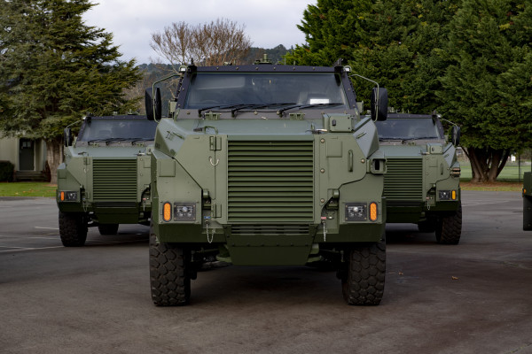

## The puppet master

El reto nos presenta una imagen que vamos a tener que analizar para ir respondiendo a las diferentes preguntas que nos van haciendo.

Si analizamos la imagen podemos obtener todos los datos:

### Identificación del vehículo— ¿Qué tipo de vehículo militar se muestra en la imagen? Observe sus características: es un vehículo con ruedas, blindado y parece ser un transporte de personal. Investigue vehículos similares en línea.

respuestas: BUSHMASTER

###  Identificación del fabricante — ¿Quién es el fabricante/diseñador de este vehículo? Investigue la empresa que diseñó y produce este vehículo blindado específico
respuestas: THALES AUSTRALIA

###  Historial de servicio — ¿Cuándo entró este vehículo en servicio militar por primera vez? Investigue el año en que este tipo específico de vehículo se desplegó operativamente por primera vez.
respuestas: 1997

### Capacidad del vehículo — ¿Cuál es la capacidad de pasajeros de este vehículo? Investigue cuántos pasajeros más tripulación puede transportar (formato: X pasajeros e Y conductor).
respuestas: 9 pasajeros y 1 conductor
