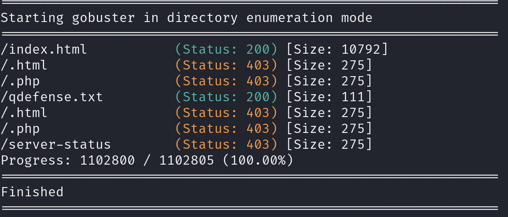
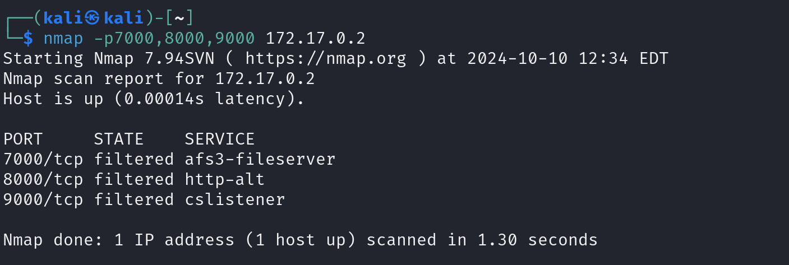
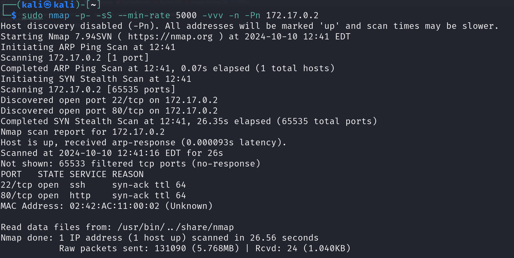
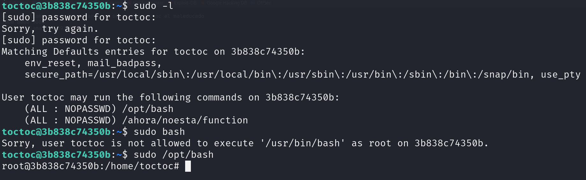

# Los 40 ladrones

## Port Enumeration

To begin our scan, we use the Nmap tool  during our discovery phase. As we can see, we have the following open ports:

```ruby
nmap -p- --open -sS --min-rate 5000 -vvv -n -Pn 172.17.0.2
```

```ruby
┌──(root㉿kali)-[/home/kali]
└─# nmap -p- --open -sS --min-rate 5000 -vvv -n -Pn 172.17.0.2  
PORT   STATE SERVICE REASON
80/tcp open  http    syn-ack ttl 64

```

## Examining the Web Page and Its Infrastructure

When executing the Gobuster command, we discover these files:



We have an interesting file called qdefense.txt, so we inspect this file:

```ruby
Recuerda llama antes de entrar , no seas como toctoc el maleducado
7000 8000 9000
busca y llama +54 2933574639
```

It appears we have a user named `toctoc`.
I'm going to scan those ports to see what we can obtain, and we see ports that are filtered:



Podemos ver que si vamos escaneando uno a uno obtnemos la siguiente informacion 


Finalmente volvemos a realizar un escaneo y vemos que el puerto 22  se ha encontrado 


Esta tecnica se utiliza para ocultar puertos y se llama Port Knocking es un mecanismo para abrir puertos externamente en un firewall mediante una secuencia preestablecida de intentos de conexión a puertos que se encuentran cerrados. Cuando el firewall recibe la secuencia correcta modifica sus reglas para permitir al host que realizo los intentos conectarse a un puerto en especifico 
aunque yo lo he realidado a mano con nmap se puede hacer con la herramienta `knock`
se instala de la siguiente manera

```shell
sudo apt update && sudo apt install -y knockd
```

## Intrusion
Con el ususario que tenemos y el nuevo puerto ssh descubierto vamos a hace run ataque por fuerza bruta con la herramienta Hydra y despues de esperar un rato nos encuentra la contraseña.


Por lo tanto ya podemos acceder por ssh con el usuario toctoc y con la contraseña 
```shell
user: toctoc
passwd: kittycat 
```

## Escalation privilege

Para la escala de privilegios primero vamos a ejecutar el comando 
```shell 

sudo -l
```
Si vemos cuales son los ficheros que podemos acceder y ejecutar con sudo  aparecen dos ficheros bastantes importantes

```shell
User toctoc may run the following commands on 3b838c74350b:
    (ALL : NOPASSWD) /opt/bash
    (ALL : NOPASSWD) /ahora/noesta/function

```

simplemente ejecutando el suiguiente comando conseguimos se usuario root 

```shell 
sudo /opt/bash
```

