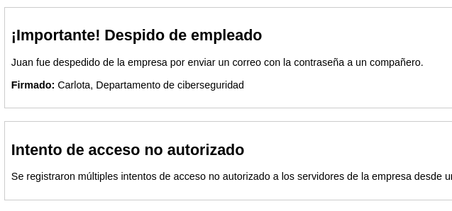
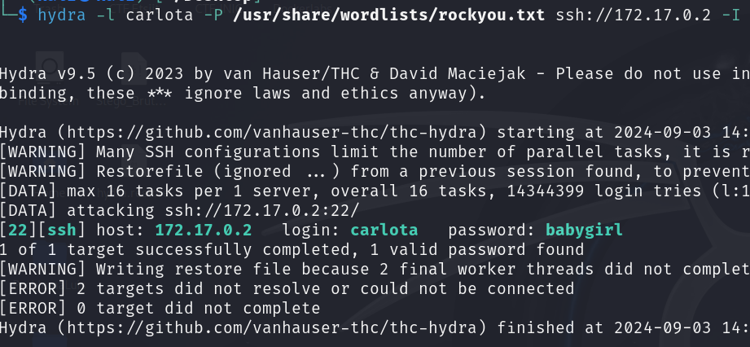
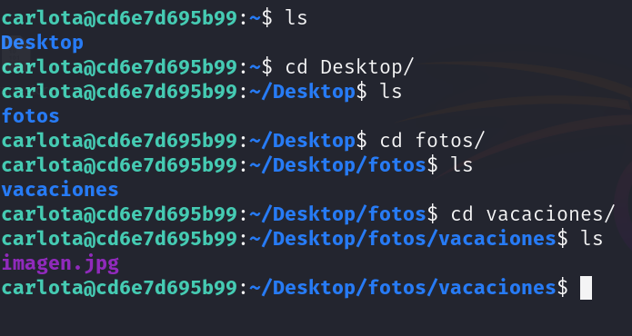
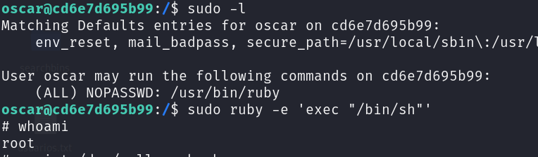

# Agua de Mayo

## Port Enumeration

To begin our scan, we use the Nmap tool  during our discovery phase. As we can see, we have the following open ports:

```ruby
nmap -p- --open -sS --min-rate 5000 -vvv -n -Pn 172.17.0.2
```

```ruby
┌──(root㉿kali)-[/home/kali]
└─# nmap -p- --open -sS --min-rate 5000 -vvv -n -Pn 172.17.0.2  
PORT   STATE SERVICE REASON
22/tcp open  ssh     syn-ack ttl 64
80/tcp open  http    syn-ack ttl 64

```

## Examining the Web Page and Its Infrastructure
We access the web page hosted on the Apache server and find this:



```ruby
Users:
Juan
Carlota
```

Now we perform a subdomain enumeration using the tool GoBuster, obtaining the following:

```ruby
gobuster dir -u http://172.17.0.2/ -t 200 -w /usr/share/wordlists/dirbuster/directory-list-2.3-medium.txt -x php,html

```

However, we don't find anything, so we're going to perform a brute force attack using the Hydra tool with the two users.

## Intrusion

Finally, we will try to authenticate to the SSH service.


``` ruby
user: carlota
password: babygirl
```
## Examining the imagen.jpg 

If we navigate through the directories, we find an image. To analyze it, it's better to download it with the following command:
ruby

```ruby
scp carlota@172.17.0.2:/home/carlota/Desktop/fotos/vacaciones/imagen.jpg /home/kali/Desktop/amor/
```


We download the image and use tools like ExifTool or Steghide to check if there is any secret inside it.


We see that if we don't enter any password, we find a secret.txt file that contains this text:

```ruby
ZXNsYWNhc2FkZXBpbnlwb24=
```

It looks like Base64 text, so let's decode it with:

```ruby
echo "ZXNsYWNhc2FkZXBpbnlwb24=" | base64 --decode
```

This command returns the following text:

```ruby
lacasadepingypong
```
It seems like a possible password for some user.

If we run the Hydra command but with rockyou as the username and the previous password, we get a match:

```ruby
user: oscar
pwd: lacasadepingypong
```

Therefore, we access with these credentials..


## Escalation privilege


If we run sudo -l, we see that we can execute 



Finally, we see that we are the root user.