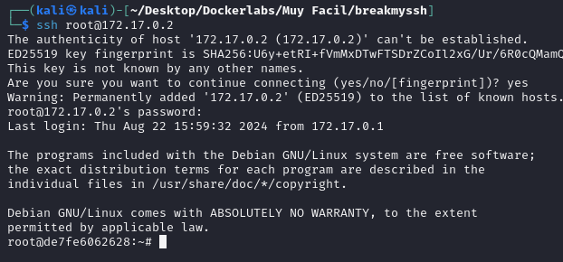

# BreakMySSH

## Port Enumeration

To begin our scan, we use the Nmap tool  during our discovery phase. As we can see, we have the following open ports:

```ruby
nmap -p- --open -sS --min-rate 5000 -vvv -n -Pn 172.17.0.2
```

```ruby
┌──(root㉿kali)-[/home/kali]
└─# nmap -p- --open -sS --min-rate 5000 -vvv -n -Pn 172.17.0.2  
PORT   STATE SERVICE REASON
22/tcp open  ssh     syn-ack ttl 64

```

## Intrusion

Now, I'm going to run a more exhaustive scan using some of the scripts implemented in the tool, including a basic dictionary attack to extract possible credentials.


We can see how it extracts the username and password. In our case, the username is 'root' and the password is 'estrella'

