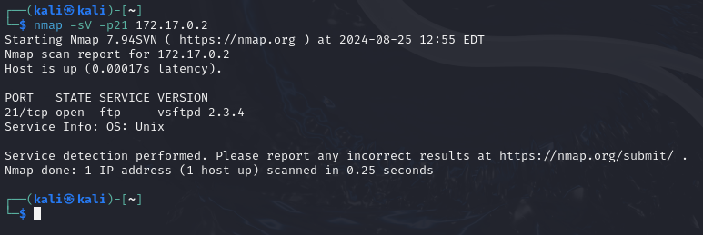
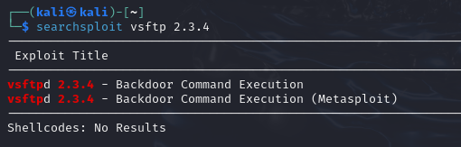
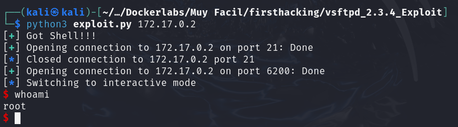

# FirstHacking

## Port Enumeration

To begin our scan, we use the Nmap tool during our discovery phase. As we can see, we have the following open ports:

```ruby
nmap -p- --open -sS --min-rate 5000 -vvv -n -Pn 172.17.0.2
```

```ruby
┌──(root㉿kali)-[/home/kali]
└─# nmap -p- --open -sS --min-rate 5000 -vvv -n -Pn 172.17.0.2  
PORT   STATE SERVICE REASON
21/tcp open  ftp     syn-ack ttl 64

```
We perform a more thorough port scan for the FTP service and check the version it's running.



We can see it's using vsftpd version 2.3.4, so we search for any related vulnerabilities using the searchsploit tool.



We find that there's one that can be executed in the Metasploit framework. To avoid using Metasploit, I'm going to check if there's a GitHub repository containing a POC (Proof of Concept) to exploit the vulnerability.

https://github.com/Hellsender01/vsftpd_2.3.4_Exploit/tree/main

I follow the steps for installing the requirements and using the tool:



Finally, we exploit the vulnerability and obtain a terminal with root user privileges.