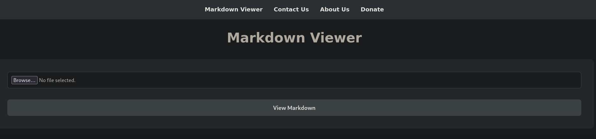

# Keeper

 
<table>
  <tr>
    <td style="vertical-align: top; padding-right: 20px;">
      
    </td>
    <td style="vertical-align: top; padding-left: 20px;">
      <strong>Vulnerabilidades / Características a tratar</strong>
      <ul>
        <li>Abusing Request Tracker</li>
        <li>Information Leakage</li>
        <li>Obtaining KeePass password through memory dump [Privilege escalation]</li>
      </ul>
    </td>
  </tr>
</table>

## Reconocimiento inicial
Realizamos un escaneo de todos los puertos para comprobar cuáles estan abiertos y lo exportamos al fichero `allports` 

```shell
nmap -p- --open -sS --min-rate 5000 -vvv -n -Pn 10.10.11.227 -oG allports
```

```shell
PORT   STATE SERVICE REASON
22/tcp open  ssh     syn-ack ttl 63
80/tcp open  http    syn-ack ttl 63

```

Vamos a realizar un escaneo más exaustivo de los siguiente puertos encontrados:


```shell
nmap -sCV -p22,80 10.10.11.227 -oN targeted
```

Se puede comprobar que no encontramos nada interesante o vulnerable.

```shell
PORT   STATE SERVICE VERSION
22/tcp open  ssh     OpenSSH 8.2p1 Ubuntu 4ubuntu0.2 (Ubuntu Linux; protocol 2.0)
| ssh-hostkey: 
|   3072 be:54:9c:a3:67:c3:15:c3:64:71:7f:6a:53:4a:4c:21 (RSA)
|   256 bf:8a:3f:d4:06:e9:2e:87:4e:c9:7e:ab:22:0e:c0:ee (ECDSA)
|_  256 1a:de:a1:cc:37:ce:53:bb:1b:fb:2b:0b:ad:b3:f6:84 (ED25519)
80/tcp open  http    Apache httpd 2.4.41 ((Ubuntu))
|_http-server-header: Apache/2.4.41 (Ubuntu)
|_http-title:  Emergent Medical Idea
Service Info: OS: Linux; CPE: cpe:/o:linux:linux_kernel

Service detection performed. Please report any incorrect results at https://nmap.org/submit/ .
Nmap done: 1 IP address (1 host up) scanned in 8.84 seconds
```

Con el siguiente comando voy a comprobar que nos encontramos en la página web.

```shell
whatweb http://10.10.11.227
http://10.10.11.227 [200 OK] Country[RESERVED][ZZ], HTTPServer[Ubuntu Linux][nginx/1.18.0 (Ubuntu)], IP[10.10.11.227], nginx[1.18.0]   
```

Voy a realizar un pequeño fuzzing y comprobar si exiten algunos directorios interesantes.

```shell
nmap --script http-enum -p80 10.10.10.68

PORT   STATE SERVICE
80/tcp open  http
```

No encontramos nada interesante 


## Intrusión 


## Tratamiento de la TTY
Como siempre hacemos el tratamiento de la TTY para ello realizamos lo siguiente

```shell
script /dev/null -c bash
CTRL Z
stty raw -echo; fg
reset xterm
```

De esta manera ya tendremos una terminal totalmente interactiva además de que podemos ir al directorio `/home` y ver la flag de user.txt


## Escalada de privilegios

